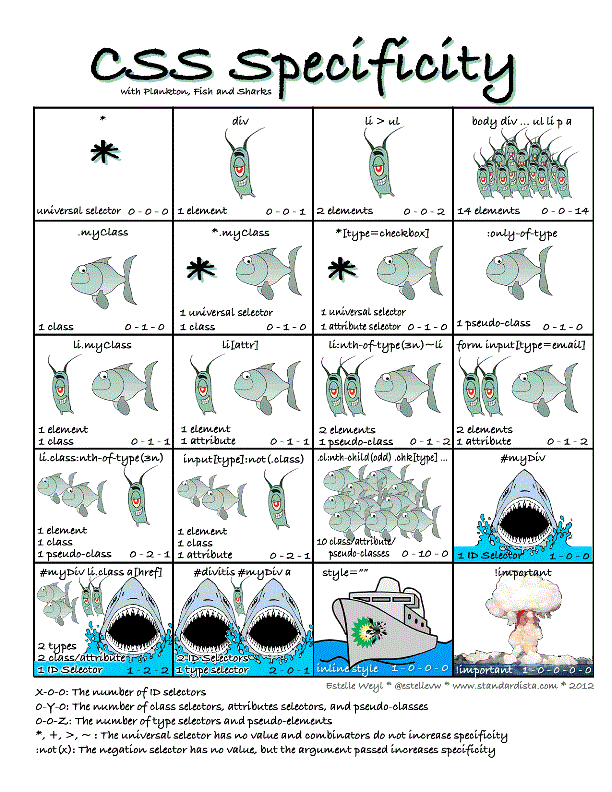

## 基本知识点

### CSS 的目的
规定 HTML 文档的呈现形式

### 样式声明语法

声明格式：`属性名:值;`

1. 元素内嵌：使用 style 属性
2. 文档内嵌：使用 style 标签/元素。&lt;style type="text/css"&gt;a{声明}&lt;/style&gt;
3. 外部样式表。&lt;link rel="stylesheet" type="text/css" href="x.css"&gt;&lt;/link&gt;
4. `@import "xx.css";` 在2、3方法种 CSS 声明处第一行进行外部导入。

### 样式的层叠
元素内嵌&gt;文档内嵌&gt;外部样式&gt;用户样式&gt;浏览器默认样式
`用户样式：用户在浏览器自定义的样式`

### 同级样式冲突和优先级

### 样式继承

- 自动继承的情况：一般和文字相关的样式会被继承，布局相关样式不会被继承。
- 可以使用`属性名: inherit`强制继承。

### CSS 单位和计算

- 颜色。内置颜色名称、rgb、rgba、hsl、hsla。
- 长度。绝对长度（in、cm等）和相对长度（rem、px、%等）。

`em 表示当前字体大小`
`rem 表示文档根元素的字体大小`
`关于像素 px 的实现：CSS 标准中要求 px 是相对长度（参考像素），但是实际浏览器当作绝对单位。`

- calc(exp)。可用于动态计算数值，如calc(100% - 100px)
- 角度。deg、rad、turn等。
- 时间。s、ms。

