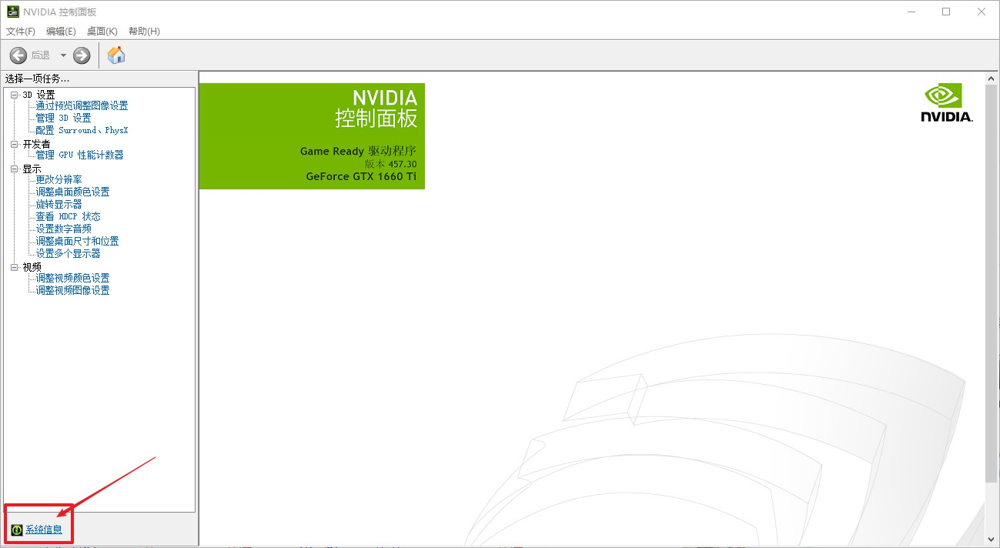
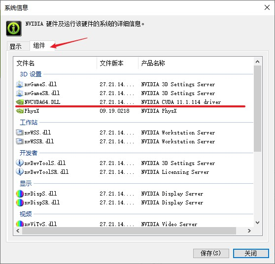
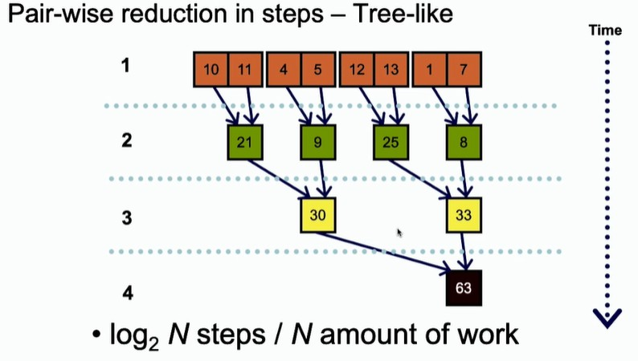

# CUDA 编程

## 基本概念

- 什么是 GPU？

GPU（Graphics Processing Unit）图形处理器，俗称显卡，主要用于图象处理和显示，如图片放大缩小、三维物体的平移和旋转、光照处理等，这些操作都需要大量浮点数计算，并且要求大量计算并行执行（例如三维游戏里，玩家换个视角，就意味着无数个向量和旋转矩阵相乘），因此 GPU 本质是一个专注并行浮点数计算的设备。

由此看来，需要大量并行处理浮点数计算的程序，如挖矿、渲染、神经网络都可以在 GPU 上运行，并且计算速度比 CPU 快一到两个数量级。

另外，CPU 能做的事，GPU 都能做，只是 CPU 注重提升复杂逻辑处理效率（流水线、指令乱序发射），GPU 注重并发执行浮点计算。

- GPU 如何并发浮点数计算？

SIMT，single instruction multithread，单指令多线程结构

可以看作多个人同时做相同的事，如果仅仅是做 a+b，那么每个人都做一样的事，没有多大意义。但是如果执行 a[]+b[]，并且给每个人分配0-n编号，那每个人就执行不同数组下标的元素求和，比传统的 for 循环要快很多。

- CUDA（compute unified device architecture 计算统一设备架构），英伟达 NVIDIA 开发的并行计算模型，支持 NVIDIA GPU卡（图形处理单元）

CUDA 变成和 C 语言几乎完全相同，上文的 a[]+b[] 写成 CUDA 代码

```C
__global__ void add(float *a, float *b, float *c) {
    int i = threadIdx.x;
    c[i] = a[i] + b[i];
}
```

对比传统 C 语言代码

```C
void add(float *a, float *b, float *c) {
    for(int i = 0;i<LENGTH;i++)
        c[i] = a[i] + b[i];
}
```

- CUDA 程序一般流程

```
1. 给 GPU 分配内存（显存）
2. 数据从 CPU 复制到 GPU
3，指定并行度，启动 GPU 计算
4. 数据复制回主机
5. 释放内存
```

## 安装

- 安装 visual studio 2019，安装时选择"使用C++的桌面开发"，之后在安装目录搜索64位的 C/C++ 编译器 cl.exe，把目录加入 path 环境变量。

```
典型 cl.exe 目录
C:\Program Files (x86)\Microsoft Visual Studio\2019\Community\VC\Tools\MSVC\14.27.29110\bin\Hostx64\x64
```

- 安装 NVIDIA 驱动程序，https://www.nvidia.cn/geforce/drivers/ ，完成驱动更新。

- 在 NVIDIA control panel 软件中，查看 CUDA 的版本，方法如下。图片中 CUDA 版本为11.1
  
</img>

</img>

- 安装 CUDA 开发工具，https://developer.nvidia.com/cuda-zone ，选择对应的版本。历史版本见 https://developer.nvidia.com/cuda-toolkit-archive 

- 安装 pycuda，`pip install -i https://pypi.tuna.tsinghua.edu.cn/simple pycuda`

## GPU 架构

- 物理架构

GPU 硬件的核心是 SM，streaming multiprocessor 流式多处理器。SM 包含 CUDA 核心、共享内存、寄存器等，可以并发的执行数百个线程。当 kernel 被执行时，grid 中的线程被分配到一个 SM 上。

SM 采用 SIMT，single instruction multipthread，单指令多线程结构，基本的执行单位是线程束 wrap，线程束包含 32 个线程。线程束上的线程执行相同的指令，但是因为有各自的寄存器，所以执行相同指令，但是控制的地址和计算结果可以不同。

线程束中的线程遇到了分支结构时，不进入分支的线程只能等待。所以线程束中出现程序分支会导致性能下降。

- 编程架构 网格、线程块

一个 kernel 的所有线程，在物理层不一定是全并发的。因为线程束 wrap 是 32，所以 block 的大小一般设置为 32 的整数倍。

## 内置变量 blockidx threadidx 三维

## 规约算法 reduction

- 定义，将多个变量的通过某种运算变成一个值，如数组求和、向量内积。单线程一般使用循环。

- 并行下，可以使用 树型并行 进行规约。

</img>

- 同步操作，需要同步等待同一行的规约完成。但是 CUDA 不支持全局同步，因为当程序块数目大于 SM 数目时，会发生死锁，没有空闲的物理线程去执行剩余的同行的规约运算。

## 注意事项

不要多个线程访问同一个地址！这样会发生冲突，导致效率低下。

## 实战，利用 CUDA 完成 CCT 粒子跟踪

1. 粒子的每一步运动，前后相关，无法并行

2. 磁场计算，实质是无数电流元磁场的叠加，可以并行

- 计算速度提升

9900T 8核16线程 运行 16 个粒子，平均用时 40.7s，平均一个粒子2.546s
1660ti 24个计算核心 运行 4320 个粒子，平均用时 353s，平均一个粒子 0.0817s，比 9900T 快31.2倍
使用廖益诚的 3070，速度还可以提高一倍以上

之前的匹配，CCT每36度分段、粒子每步运行5mm，才能勉强进行优化，但精度过低，像空间点实际差5mm/mr左右
现在 GPU 按照3度分段，粒子每步1mm，可以快速优化