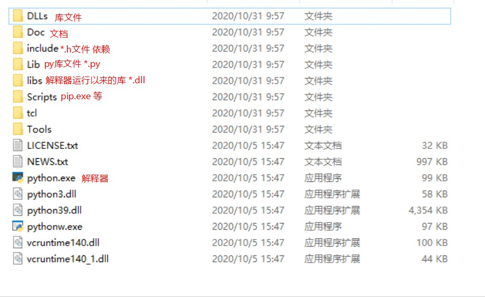

# python 入门

https://www.bilibili.com/video/BV1R7411F7JV

## 安装和环境变量

默认安装目录：C:\Users\当前用户\AppData\Local\Programs\Python\Python39

默认设置的环境变量：两个PATH目录 'C:\Users\madoka_9900\AppData\Local\Programs\Python\Python39\Scripts\' 和 'C:\Users\madoka_9900\AppData\Local\Programs\Python\Python39\'

- 目录结构

</img>

## 变量类型

int float str

## 字符串处理和print

- 字符粗是一个 seq，所以可以用 ch in str、[]

判断子串是否存在。'aa' in 'baa'

取子串 str[i:j] ，包括 i 不包括 j

取最后三个字符。str[-3:]

倒序输出。str[::-1]

- 引号：单引号，双引号，三引号。

- r + 字符串。原样输出，不会发生转义。 print(r'\n') 

- 占位符1。'age=%d,name=%s,pi=%5.2f'%(12,'mdk',3.14)

- 占位符2。"age={},name={},pi={}".format(12, "mdk", 3.14)

- 转字符串 str() 函数。

- print 函数

print('打印多个字符串','str1','str2','默认空格分割','默认尾加换行')

函数签名：print(value, ..., sep=' ', end='\n', file=sys.stdout, flush=False)

## 运算符

- 乘方运算符 **

- 整除 //

- str1 == str2 。比较字符串内容。

- var1 is var2。地址是否相同。

- 逻辑运算符。 and or not

- 位运算。&amp; | ~ ^ &gt;&gt; &lt;&lt;

- 三元运算符 exp1 if bool else exp2 。相当于 bool?exp1:exp2;

## 语句

- 条件语句

```python
if bool1:
    exp1
elif bool2:
    exp2
else:
    exp3
```

- for 循环语句

```python
for var in seq:
    exp
```

```python
# [0,9] 循环
for i in range(0,10):
    print(i,end=' ')
```

```python
for var in seq:
    exp1
else: # 循环正常结束执行，不正常结束(break)就不执行
    exp2
```

- while 循环语句

```python
while bool:
    exp
```

- pass 空语句。相当于 ;

- continue break

<p hidden>2020年10月31日</p>

## 列表 list

- 空列表。arr = []

- 构建列表。arr=[1, 2]

- arr[-1] 最后一个元素

- len(arr)。即 arr.length

- ele in arr。即 arr.contains(ele)

- del arr[1]。删除第一个元素，相当于arr.remove(ele)，或者 arr.pop(1)

- 切片。就是 subList

- 尾加元素。arr.append(ele) 

- 插入。arr.insert(i, ele)

- 添加数组。arr.extend(arr2)，或者 arr + arr2

- arr.sort() 排序。

## 元组 tuple

- 空元组。arr=()

- 列表转元组。tuple(list)

- 拆包。a,b = (1, 2)

- 不定拆包。a,*b,c = (1,2,3,4,5,6)。a=1, c=6，b=[2,3,4,5]

- 不定拆包2。a,*b = (1,)，则 a=1, b=[]

- 装包。* + 序列。

```python
print(*'123')
print(*[1,2,3])
print(*(1,2,3))
```

## 字典 dict

- 空字典。{}

- 构建字典。{'id':12}

- 列表/元组转字典。dict([('name','mdk'),('age',12)])

- 取值。d[key]，当不存在值时会报错，另外可以使用d.get(key)，不存在时返回None

- 增加/修改kv对。d[key]=value

- 删除。del d[key]，或者d.pop(key)。python真是有病

- 遍历1。for k in m

- 遍历2。for k,v in m.items()

- items()函数。即 entries()

- values() 函数，keys() 函数

## 集合 set 无序不重复

- 空集合。{} —— **错误，使用{}创建的是字典，不是集合**

- 构造。{e1, e2, e3}

- list去重。list(set(li))

- 指定删除 s.remove(ele)，删除不存在的元素会报错。s.discard(ele)，同样是删除，但是删除不存在的元素不会报错

- 随机删除。s.pop()

- s.update(seq)，把seq中的元素加入集合

- s1 - s2。差集。difference

- s1 & s2。求共同元素，交集。intersection

- s1 | s2。求并集。union

- s1 ^ s2。求 (s1 & s2) - (s1 | s2)。对称差集，symmetric_difference

- 转不可变集合。frozenset(s)

<p hidden>2020年11月5日</p>

## 集合类的推导式 旧的集合 --> 新的集合

- [fun/i for i in seq [if cond] ]  # map 和 filter 一起

- 过滤名字长度小于等于3的，[n for n in names if len(n)<=3]

- 将字符串 map 为长度 [len(n) for n in names]

- [i for i in range(101) if i % 3 == 0] # 0-100 能被 3 整除的数字

- 笛卡尔积。cross = [(x,y) for x in arr1 for y in arr2]

- {推导式} 集合推导式

- {f(k):g(v) for k,v in dict} 字典推导式

```python
m = {10: "aaa", 2: "b"}
{k: len(v) for k, v in m.items()} # 把 value map 为长度
```

- 列表推导式是非懒惰的，是要执行就会生成完整列表。

## 生成器 generator 和 yield 和 携程

- 列表生成器 (fun(x) for x in seq) ，即把列表推导式的方括号换成小括号。示例：(x*3 for x in range(20))

- 获取生成器的下一个元素。对象方法 gene.__next__() ，内置函数法 next(gene)

- 生成器也是 seq，可以用 for i in gene 遍历

- yield生成器。yield相当于return和暂停

```python
# 无限生成器
def addOne():
    n = 0
    while True:
        n += 1
        yield n

# 有限生成器
def addOne(length=5):
    n = 0
    while n < length:
        n += 1
        yield n

# 带有yield的函数，返回值为生成器
# <generator object addOne at 0x000001DDBBCD94A0>
print(addOne())
```

- yield生成器示例：..\code_snipaste\生成器_斐波拉契数列.py

- yield生成器的 send() 方法和 yield 的返回值，实现向生成器传递信息
  
```python
def sendYield():
    while True:
        sent = yield 5
        print(f"sent = {sent}")
        if sent == 4:
            break

gene = sendYield()

print(gene.send(None))
print(gene.send(1))
print(gene.send(2))
print(gene.send(3))
print(gene.send(4))
print(gene.send(5)) # StopIteration
```
- 生成器中没有下一个元素，则 next 抛出 StopIteration

- 生成器和协程。yield表示暂停并推出生成器，所以可以快速切换

```python
def task1(n):
    for i in range(n):
        print(f"搬砖{i}")
        yield

def task2(n):
    for i in range(n):
        print(f"听歌{i}")
        yield

g1 = task1(5)
g2 = task2(5)

for i in range(5):
    g1.__next__()
    g2.__next__()
```

## 可迭代对象 Iterable 和 迭代器 iterator

- 可迭代对象包括 生成器 各种集合

- 判断对象是否可迭代 isinstance(obj, Iterable)

- 各种集合是**可迭代对象**，但不是**迭代器**，可以用 iter() 函数获取**可迭代对象**的**迭代器**

## 函数

- def fun(*args) 可变参数传入元组。

- 有默认值参数。def fun(k=v)

- 指定传参。fun(v1=1, v2=2)

- def fun(**kwargs) 字典参数。按照fun(v1=1, v2=2)传参。

- 字典拆包传递fun(**di)

- return v1, v2 。返回多个值，变成元组。

- 全局变量和局部变量。局部变量可以覆盖全局变量。函数内修改全局变量，需要声明 global var

- global 是多此一举吗？ 不是。因为函数中 a = 1，有歧义，可以理解为**声明**局部变量 a，也可以理解为**修改**全局变量。所以当修改列表list[0]=1时，没有歧义，所以不用global

- nonlocal 访问上层函数变量，实现闭包。

- 内置函数 locals() 查看当前局部变量

<p hidden>2020年10月31日</p>

- 闭包的定义。函数A返回一个函数B，函数B使用了函数A的局部变量。先看看：闭包是理解装饰器的基础

## 装饰器

- 装饰器。就是Java的方法代理。

```python
# 定义装饰器，装饰器就是一个函数，接受的参数是函数
def wrap(core_method):
    times = 1
    def wraped(): # 若参数不定，则使用 *args
        nonlocal times
        core_method() # 若参数不定，则使用 *args
        print(f'函数{core_method}被调用{times}次')
        times+=1 

    return wraped # 返回增强后的函数


@wrap # 注解名称为装饰器名字
def core():
    print('执行核心业务')

# 运行结果
# 执行核心业务
# 函数<function core at 0x000001DAFE85BF70>被调用1次
# 执行核心业务
# 函数<function core at 0x000001DAFE85BF70>被调用2次
```

- 装饰器可以多个重叠。

- 带参数的装饰器。三层函数，外层接受参数器的值，中层接受被装饰的函数，内层接受被装饰的函数的入参。

```python
# 全部代码见 books\python\code_snipaste\代餐装饰器_模拟路由转发.py
routers = {} # 全局变量 注册的路由-方法
def router(path):
    def wrap(method):
        routers[path] = method  # 注册路由
        def core(*args, **kwargs):
            print(f"访问路径{path}，携带参数{args}和{kwargs}")  # 方法增强
            method(*args, **kwargs)  # 核心业务
        return core
    return wrap

# 使用 @router('/xxx') 注释函数
```

## 匿名函数 lambda

- lambda a,b : a+b

- 空参lambda。`lambda :print('空参λ')`

- map()，内置函数，输入一个函数和seq，返回seq。`list(map(lambda x: x * 2, [1,2]))`

- reduce(biconsume ,seq ,init)

```python
print(reduce(
    lambda x,y:x+y,
    range(11),0
)) # 55
```

- filter(predicate,sqe)。`filter(lambda x:x<10,[4,10,11])`

## 文件IO

- 使用内置函数 open 获得流，使用 read write 进行读写

- __file__ 当前文件

- os 模块，os.path.join(os.path.dirname(__file__), 'new.txt') # 当前目录下，拼接文件

- 相对路径从 OS 模块拿到

- 注意：内置模块仅仅提供了最基本的文件读写，其他的目录操作，都在 OS 模块中

## 异常机制

- try except [错误类] [as 错误对象] 异常处理 [else 异常执行的代码] [finally 最终执行]

- except 可以多个，分别抓不同的异常

- 所有的异常类，都继承自 Exception

- 抛出异常 raise Exception('msg')

## 面向对象

- 所有对象继承自 object

- 获取对象实例 obj = Obj()，相当于 Java 省略 new

- 创建空类。class Student: \tpass

- 属性。类和对象的属性都可以动态的添加删除

- 方法。普通方法，类方法，静态方法，魔术方法

- 模式方法。这里省略前后下划线，init、new(先于init)、del、call（对象变成函数）、str(就是Java的toString)

```python
class Person:
    MAX_AGE = 100  # 类对象
    __MIN_AGE = 0  # 类私有对象

    def __init__(self, age):  # 构造器。魔术方法之一，魔术方法就是__xx__()
        self.age = min(age, Person.MAX_AGE)  # 实例对象

    def normalMethod(self):  # 普通方法 实例方法
        print(f"普通方法就是实例方法 age={self.age}")

    @classmethod  # 类方法。至少有一个入参，入参为类自身
    def clsMethod(cls, val):
        print(f"类方法{cls.MAX_AGE} val={val}")

    @staticmethod  # 静态方法。可以没有入参
    def staMethod():
        print(f"静态方法{Person.MAX_AGE} {Person.__MIN_AGE}")  # 静态方法可以访问Person的私有对象
```

- 私有属性和POJO。使用__开头。私有的底层原理，把属性名改为_类名__属性名

```python
class A:
    def __init__(self, name):
        self.__name = name
    @property # getter 使用 . 直接取值
    def name(self):
        return self.__name
    @name.setter # setter
    def name(self, name):
        self.__name = name


a = A("1111")
print(a.name)
a.name = "22"
print(a.name)
```

- 继承。class Son(Father)，调用父类构造器 super().__init__(val)

```python
class Father:
    def __init__(self,name):
        self.name = name 
    def hello(self):
        print(f'hello {self.name}')

class Son(Father):
    def __init__(self,name,age):
        super().__init__(name) # 相当于Java super(val)
        self.age = age
    def hello(self): # 重写方法
        print(f'hello {self.name} {self.age}')
    def fun(self):
        print('子类的方法')

s = Son('abc',12)
s.hello()
s.fun()
f = Father('zzz')
f.hello()
```

- python 支持多重继承。class A(B,C):pass。多继承的方法重写存在查找顺序(广度/深度优先搜索)一说(因为仅仅靠就近原则还不够)，可以用 cls.__mro__ 查看。

- 了解一下：重写 __new__ 方法，实现单例模式

<p hidden>2020年11月6日</p>

## 模块和包

- 模块：功能相近的遍历/函数/类放到一个文件(.py)中

- 模块的导入 import m，然后使用 m.xx 使用

- 模块的指定导入 from m import xx，可以直接 xx 使用

- 模块导入全部 from m import * 

- 限制 * 的获取。模块文件中，使用 __all__ = ['a1'] ，则 from m import * 只能导入 a1，仍可显式导入

- if __name__ == "__main__": pass 。调用模块不会执行。这是因为调用模块时，__name__ == 模块名

- 包 package：一个文件夹，包含 __init__.py 文件和多个模块(.py)

- 导包时，首先会执行 __init__.py 文件（做一些初始化工作）。这里面定义的东西，可以用 包.xx 使用

- 包的导入 from p import m，或者 from p.m import xx

- 包 A 中 b.py 调用 c.py，则 b 中最好写 from A.b import xx

- 包 A 导入同级的包 B，写出包就可以了

- 模块存在循环导入的问题

## 其他

- type(var) 查看变量类型。

- 命名规范。python推荐下划线式，如 get_name

- help(print) 查看帮助

- int(var) 转整形。float(var) 转浮点数。

- id(var) 类似地址。

- 交互模式下只有小整数对象池。批处理模式下，大整数对象池。

- 不可变类型（unmutable）：数字，字符串，元组

- bin(num) 查看二进制

- 空字符串的bool值为 False

- range() 不是一个数组，相当于一个 generator？

- list(range()) 转数组

<p hidden>2020年10月31日</p>

- isinstance(obj,class) 

<p hidden>2020年11月5日</p>

- sys.getrefcount(obj) 获得引用次数

- dir(obj) 获得对象obj的所有对象方法名

<p hidden>2020年11月6日</p>