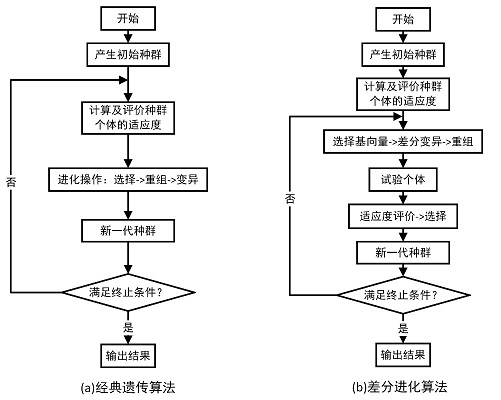
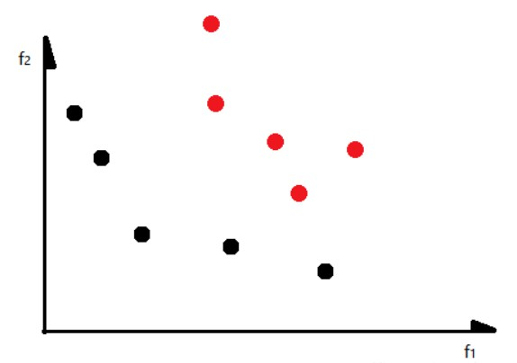
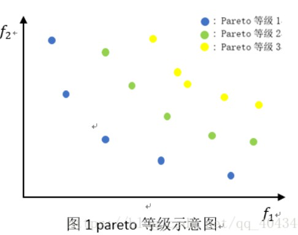
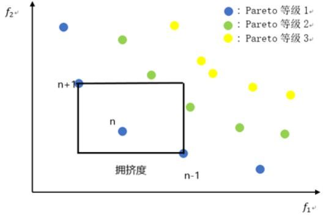

# 进化算法介绍

http://geatpy.com/index.php/ea_introduction/

## 序言

进化算法(Evolutionary Algorithm, EA)是一类通过模拟自然界生物自然选择和自然进化的随机搜索算法。与传统搜索算法如二分法、斐波那契法、牛顿法、抛物线法等相比，**进化算法有着高鲁棒性和求解高度复杂的非线性问题**(如NP完全问题)的能力

在过去的40年中，进化算法得到了不同的发展，现主要有三类：

1)主要由美国J. H. Holland提出的的遗传算法(Genetic Algorithm, GA)；

2)主要由德国I. Rechenberg提出的进化策略(Evolution strategies, ES)；

3)主要由美国的L. J. Fogel提出的进化规划(Evolutionary Programming, EP)。

文档第一章是有关遗传算法的概述和基本框架；第二章介绍了编码；第三章是关于适应度的计算；第四章讲述了选择算法；在第五章中，介绍了不同的重组算法；第六章解释了如何变异；第七章详细讲解了与多目标优化有关的概念。

## 第一章：概述

对于常规遗传算法，在计算开始时，根据设计的编码规则随机初始化许多个体(形成一个或多个种群)，然后评估种群中个体的适应度，并根据适应度来选择一些个体到交配池，然后对交配池中的个体进行一定概率的重组和变异产生育种后代。**至此，环境中同时存在父代和育种种群，此时需要从中选择出一些个体最终得到新一代种群**

在这个过程里面出现了两次选择：第一次是从当前种群中选择出一些个体参与重组和变异等进化操作；第二次是在父代和重组变异得到的育种后代中选择一些个体保留到下一代，这个阶段的选择也有时候被称为“重插入”或者“环境选择”。

### 经典遗传算法和经典差分进化算法



<p hidden>左图是经典的遗传算法流程图，可以看到它里面只出现了一次选择。实际上，它在重组和变异得到育种个体之后，无条件地代替了父代个体而形成新一代种群，这本质上也是一次选择，只是在选择中把父代所有个体都淘汰掉了。这种做法也有一定的弊端：收敛速度较慢。因此有不少加入了“精英保留”的改进型遗传算法，比如把育种种群的绝大部分个体（小于全部）代替父代中等数量的非最优个体而得到新一代种群；另外还有把父代个体和育种个体合并，在统一的、相同的环境下进行择优选择一半个体得到新一代种群；差分进化里面的一种经典做法是按照个体的索引顺序，每个育种个体只与其相同位置上的父代个体进行优胜劣汰保留其中一个，从而得到新一代种群。</p>

选择、重组和变异是进化算法提供的经典操作算子。很多改进的进化算法都是围绕他们展开的。或许在命名上可能十分多样化，但万变不离其宗，本质上也能够被归入到这几类操作算子当中。

## 第二章：编码和解码

编码就是将问题的解空间映射到编码空间(即搜索空间)上的过程。而由编码空间向问题的解空间的映射就成为解码。

按照编码结果的数据类型分类，编码可以是：一维或二维的数据列、二进制数据列或字符串等。

按照映射方式来分类，编码可以是：简单映射编码、多重映射编码、排列编码、树编码等。

一般而言编码需要满足以下三个原则：

1)完备性：问题的解空间中所有的点都可以映射到编码空间中的点(即染色体)。

2)可靠性：编码得到的染色体必须对应问题空间中的某一个潜在解。

3)非冗余性(不强制要求)：染色体和潜在解之间必须一一对应。

## 第三章：适应度

适应度是指种群个体”适应环境的能力”。

**适应度的值必须是非负实数。**

还可以对目标函数作线性变换、指数变换、幂指数变换、截断处理等得到适应度。这些变换都会对种群的多样性和算法的收敛速度带来影响。

在适应度计算中我们常常引入”罚函数”来解决带复杂约束的优化问题。”罚函数”通过对非可行解施加惩罚，以此来降低不符合约束条件的”非可行解”个体在下一代中的生存概率。**在遗传算法中我们不完全否定非可行解。因为在搜索空间中非可行解有可能非常接近最优可行解**。

### 基于等级划分的适应度分配计算 Rank-based fitness assignment

这种适应度计算方法不是直接对目标函数进行变换来计算的个体的适应度的，而是先根据目标函数值来对个体进行排序，然后根据个体在排序中的位置来确定其适应度。

### 单目标和多目标问题下适应度的问题

上面的适应度计算方法都是对单目标问题而言的。然而，在许多现实问题中，为评估个体的质量好坏，必须考虑多个标准才能确定个体的优越性。这就涉及到多目标的优化问题。我们可以通过线性加权法把多个单目标的目标函数值加权得到多目标的目标函数值，进而使用上面所述的一些单目标问题的适应度计算方法。也可以采用特殊的方法，如帕累托非支配排序法等。

## 第四章：选择

在第一节“概述”中提到在进化算法中存在两个阶段的选择。（选择个体参与进化、选择个体进入下一代）

第一次是参与进化操作的个体的选择。这个阶段的选择可以是基于个体适应度的、也可以是完全随机地选择交配个体。**一旦个体被选中，那么它们就会参与交叉、变异等进化操作**。未被选中的个体不会参与到进化操作中。

第二次是常被称为“重插入”或“环境选择”的选择，它是指在个体经过交叉、变异等进化操作所形成的子代（或称“育种个体”）后用某种方法来保留到下一代从而形成新一代种群的过程。**这个选择过程对应的是生物学中的”自然选择”**。

### 重插入

即选择怎样的个体进入下一代，这些个体有两个来源——父代直接进入（一般是精英）、父代里交叉/编译的个体。

重插入方案有很多种，如锦标赛。

## 第五章：重组

进化算法中的重组有时俗称为”交叉”，但系统地看，重组包含了交叉。重组算法是改进进化算法最有效的环节，它通过结合交配群体中包含的遗传信息产生新的个体。因为进化算法中有二进制编码、实值编码、排列编码、树编码等，因此必须也有与编码方式相适应的不同的重组算法。

重组算法也有还能多种，实数下有更丰富的算法。中间重组、线性重组、值互换重组——交叉。

## 第六章：变异——避免陷入局部最优

变异是指通过改变染色体中的一部分元素来形成新的染色体的过程。它能够提高种群的多样性，降低进化算法陷入局部最优解的风险。

编译算法也有很多种。

## 第七章：多目标优化

有些多目标优化问题中各个目标之间会有冲突，无法同时取得最优，例如工人的工资和企业的总利润。

### 多目标优化问题数学模型及最优解

多目标优化问题是在给定约束条件的前提下，求多个目标函数的最大或最小的问题。一般可表述为如下形式：

```
min{ zi = f(x) }
s.t. gi(x)<=0
```

其中 zi 是多个目标函数，需要最大化或者最小化。gi 是约束函数。

多个目标之间可能会拥有不同的单位，也可能在优化某个目标时损害其他目标。但这并不意味着多目标优化问题可能没有最优解，事实上是可以有的，为了求出比较合理的解，这里引入多目标优化问题的合理解集——Pareto最优解。

### Pareto最优解

首先规定：以下讨论都是最小化目标。

- Pareto支配 Pareto Dominan 
  
**x** 支配 **y** == **x** ≺ **y** == ∀ fi(**x**) ≤ fi(**y**) 且 ∃ fi(**x**) < fi(**y**)

**x** 至少存在一个目标分量中小于 **y**，并且其他目标分量也不会比 **y** 大

- Pareto 最优解 Pareto Optimal Solution

Pareto 最优解 == x' ==  x' 不被其他的解支配

- Pareto 集 Pareto Set

**注意这个集合中的元素是决策变量 x，不是目标值 f**

一个多目标优化问题，对于一组给定的最优解集，如果这个集合中的解是相互非支配的，也即两两不是支配关系，那么则称这个解集为 Pareto Set。

如下图中黑点组成的集合。



- Pareto 前沿 Pareto Front

**注意这个集合中的元素是目标值 f，不是决策变量 x**

Pareto Set 中每个解对应的目标值向量组成的集合称之为Pareto Front, 简称为PF。


- 非支配解

如果对于一个决策变量，不存在其他决策变量能够支配他，那么就称该决策变量为非支配解。

- Pareto 等级 / 支配等级

在一组解中，非支配解 Pareto 等级定义为1，将非支配解从解的集合中删除，剩下解的 Pareto 等级定义为2，依次类推，可以得到该解集合中所有解的 Pareto 等级。



- 拥挤度：为了使得到的解在目标空间中更加均匀

从二目标优化问题来看，就像是该个体在目标空间所能生成的最大的矩形（该矩形不能触碰目标空间其他的点）的边长之和。



看来拥挤度大，说明周围的同等级个体少。

- NSGA-II 精英保留策略

1. 首先将父代种群Ci和子代种群Di合成种群Ri
   
2. 根据以下规则从种群Ri生成新的父代种群C(i+1)
   
根据Pareto等级从低到高的顺序，将整层种群放入C(i+1) ，直到某一层该层个体不能全部放入C(i+1)

​将该层个体根据拥挤度从大到小排列，依次放入C(i+1) 中，直到填满

### 用进化算法解决多目标优化问题

进化算法如遗传算法、粒子群算法、差分进化算法等都可以很好地解决多目标优化问题。以遗传算法为例，目前具有代表性的多目标优化遗传算法按历史进程分类如下：

1)第1代：帕累托排序法。

向量评价遗传算法(vector evaluated genetic algorithms, veGA)[1]

SchafferJD.Multipleobjectiveoptimizationwithvectorevaluatedgeneticalgorithms[C].Proceedings of 1st International Conference on Genetic Algorithms and Their Applications, p.93-100, 1985

2)第2代：非支配排序+保持种群多样性。

多目标遗传算法(Multiobjective Genetic Algorithm, moGA)[2]

Fonseca C M, Fleming P J. Genetic algorithms for multiobjective optimization: for-mulation,discussionandgeneralization[C].Proceedingsof5stInternationalConferenceonGe-netic Algorithms and Their Applications, pp. 416-423, 1993

非支配排序多目标遗传算法(non-dominated sorting genetic algorithm, nsGA)[3]

Srinivas N, Deb K. Multiobjective function optimization using nondominated sortinggenetic algorithms[M]. Evlutionary Computation, Chapter 3, pp. 221-248, 1995

3)第3代：多目标函数加权；改进非支配排序选择；基于分解；基于评价指标；等等。

随机权重遗传算法(random weight GA, rwGA)[4]

Ishibuchi H,Murata T. A multiobjective genetic local search algorithm and its applica-tion to flowshop scheduling[J]. IEEE Transactions on Systems, Man and Cybernetics, vol. 28,no, 3,pp, 392-403,1998

适应性权重遗传算法(adaptive weight GA: awGA)[5]

Gen M. Cheng R. Genetic Algorithms and Engineering Optimization[M]. New York,John Wiley & Sons, 2000

Pareto强度进化算法II(strength Pareto E A II, spEA-II)[6]

ZitzlerE,LaumannsM,ThieleL.SPEA2: ImprovingtheStrengthParetoEvolutionaryAlgorithmforMultiobjectiveOptimization[C].ProceedingsoftheEUROGENConference,pp.95-100,2002.

非支配排序遗传算法II(non-dominated sorting G A II, nsGA-II)[7]

Deb K, Pratap A, Agarwal S, Meyarivan T. A Fast and Elitist Multiobjective GeneticAlgorithm: NSGA-II[J]. IEEE Transactions on Evolutionary Computation, val, 6, no.2, pp,182-197,2002

基于超体积作为选择指标的EMO进化优化算法[8]

Emmerich M , Beume N , Naujoks B . An EMO Algorithm Using the Hypervol-ume Measure as Selection Criterion[M]// Evolutionary Multi-Criterion Optimization. SpringerBerlin Heidelberg, 2005

交互式适应性权重遗传算法(interactive adaptive weight GA, i-awGA)[9]

Lin L, Gen M. Bicriteria Network Design Problem Using Interactive Adaptive-weightGA and Priority-based Encoding Method[J]. IEEE Trans, on Evolutionary Computation, 2006

基于分解的多目标进化算法(A Multiobjective Evolutionary Algorithm Based on De-composition, MOEA/D)[10]

Zhang Q , Li H . MOEA/D: A Multiobjective Evolutionary Algorithm Based on De-composition[J]. IEEE Transactions on Evolutionary Computation, 2008, 11(6):712-731

4)第4代：基于参考点的多目标进化优化算法。

基于非支配排序及参考点的NSGA III算法[11]

Deb K , Jain H . An Evolutionary Many-Objective Optimization Algorithm UsingReference-Point-Based Nondominated Sorting Approach, Part I: Solving Problems With BoxConstraints[J]. IEEE Transactions on Evolutionary Computation, 2014, 18(4):577-601

由参考向量引导的进化优化算法(Referencevectorguidedevolutionaryalgorithm,RVEA)[12]

Cheng R , Jin Y , Olhofer M , et al. A Reference Vector Guided Evolutionary Algo-rithm for Many-Objective Optimization[J]. IEEE Transactions on Evolutionary Computation,2016:1-1

对于一个具体的多目标进化算法(Multi-objectiveEvolutionaryAlgorithm: MOEA)而言，如何构造非支配集，采用什么策略来调整非支配集的大小，如何提高非支配集中解的分布性和提高收敛速度，是决定其算法性能的重要内容，这些也是当前相关研究的热点。

