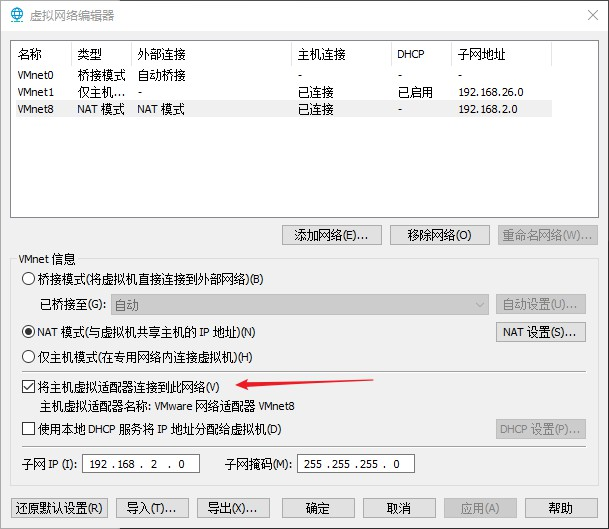
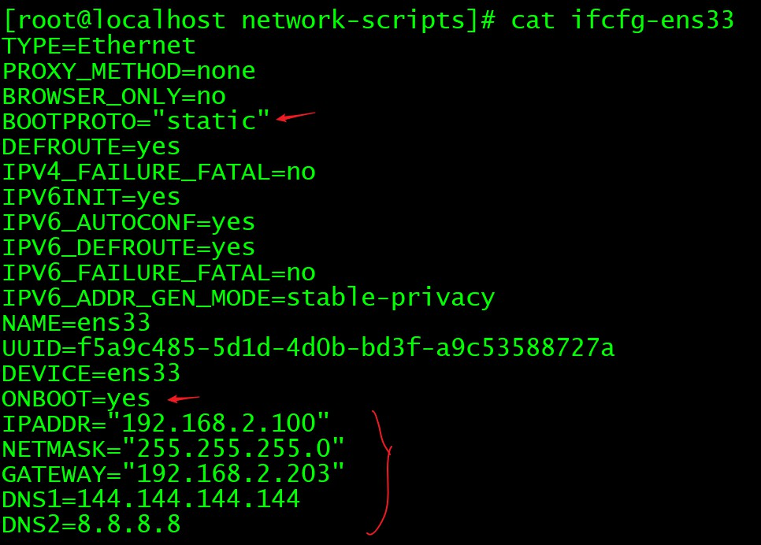
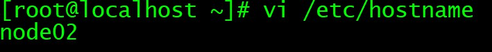
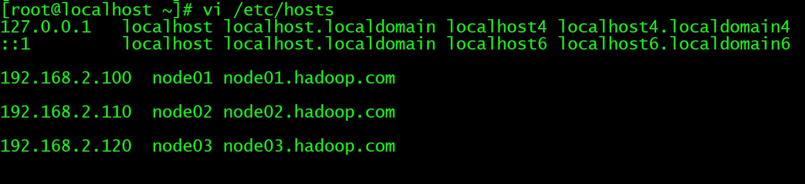
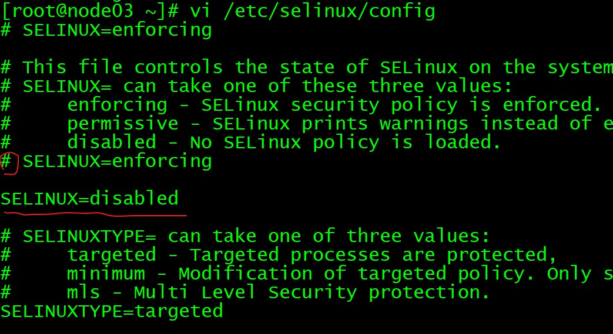

# 准备工作

1. VMware 网络设置：NAT 网络，子网 192.168.2.0 网关 192.168.2.203

2. 给对应网络设置 IP 和 DNS，在物理机/主机上设置，

注意：需要在 VMware NAT 设置中开启

</img>

然后在主机中进行 ip 设置，这里分配 ip = 192.168.2.88

3. 安装 centos7，直接最小化安装，安装完后设置网络

root 密码 root

ip addr 查看网络配置，网卡名字

cd /etc/sysconfig/network-scripts 进入网卡配置

修改对应的网卡，修改如下

</img>

4. 复制两台虚拟机，配置好各自的 ip 地址，确保互通

node01 192.168.2.100

node02 192.168.2.110

node03 192.168.2.120

5. 修改主机名和域名映射

</img>

</img>

6. 关闭防火墙和 SELinux

- centos6 关闭防火墙

service iptables stop # 关闭防火墙

chkconfig iptables off # 禁止开机启动

- centos7 关闭防火墙

systemctl stop firewalld.service # 停止firewall

systemctl disable firewalld.service # 禁止firewall开机启动

- 疑问：什么是 SELinux？

答：Linux 安全子系统。

Linux 中权限管理基于文件，因此 root 用户启动的进程可以操作任何文件。

SELinux 还增加了对进程的限制。

关闭方法如下

</img>

7. 集群内免密 SSH 登录

痛点：主节点需要控制从节点，若无法免密登录，则很麻烦

- SSH 工作原理

B 配置 A 的公钥

当 A 请求登录 B 时，B 使用 A 的公钥加密随即文本，发给 A

A 收到后用私钥解密，发送回去

B 验证文本

- 配置方法

每台主机生成自己的公私钥对
ssh-keygen -t rsa

每台主机拷贝公钥到第一台主机（第一台自己也要拷贝） 
ssh-copy-id node01

将第一台主机的所有公钥拷贝到其他主机（在第一台主机上执行）
scp /root/.ssh/authorized_keys node02:/root/.ssh

验证
ssh node0x
使用 exit 退出

8. 三台主机时钟同步

同步方案：1）所有主机和某台主机时钟同步；2）利用互联网，和时钟同步服务器同步

这里采用方案2

```
## 安装 ntp，-y 安装过程全选为 yes
yum install -y ntp
## 编辑定时任务
crontab -e
## 每分钟和时钟服务器同步
*/1 * * * * /usr/sbin/ntpdate ntp4.aliyun.com;
```

9. 安装 jdk8

```
## 如果存在 openjdk 先卸载
rpm -qa | grep java

## 创建两个目录
mkdir -p /export/softwares # 存软件包
mkdir -p /export/servers # 安装目录

## jdk8 上传到/export/softwares并解压
tar -zxvf jdk8xxx.tar.gz -C ../servers

## 配置环境变量
vi /etc/profile

export JAVA_HOME=/export/servers/jdk1.8...
export PATH=:$JAVA_HOME/bin:$PATH

## 生效
source /etc/profile

## 可以远程复制 jdk 包到其他的主机
scp -r /export/servers/jdk node02:/export/servers
```

10. 安装 MySQL（很多服务需要）

只在 node03 安装 MySQL

```
## 在线安装
yum install mysql mysql-server mysql-devel

## 启动 MySQL 服务
/etc/init.d/mysqld start

## 自动设置参数
/usr/bin/mysql_secure_installation

## 授权
grant all privileges on *.* to 'root'@'*' identified by '123456' with grant option;
flush privileges;
```

上面不好用，使用 docker

```
yum -y install docker

systemctl start docker

systemctl status docker

docker pull mysql:5.7

docker run -p 3306:3306 --name mysql57 \
             -e MYSQL_ROOT_PASSWORD=123456 \
             -d mysql:5.7
```

vscode 管理 MySQL
https://www.sohu.com/a/387319102_468635 