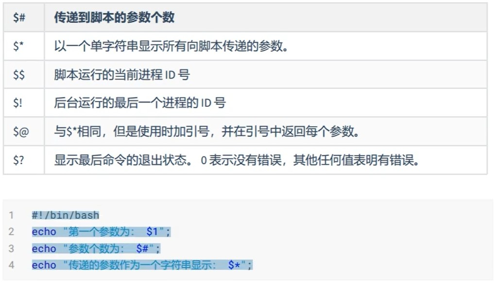
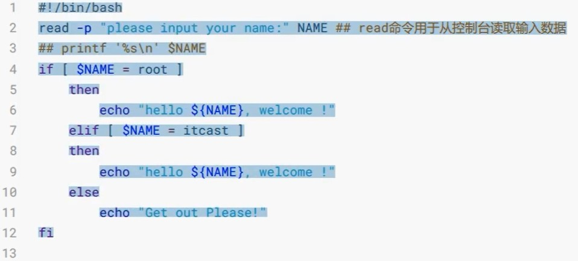
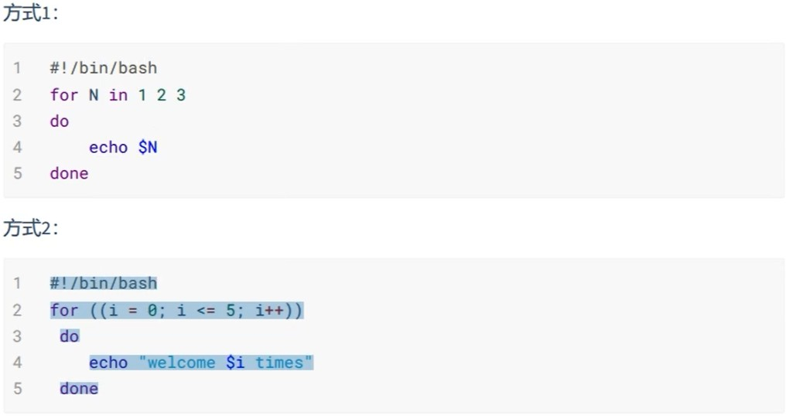
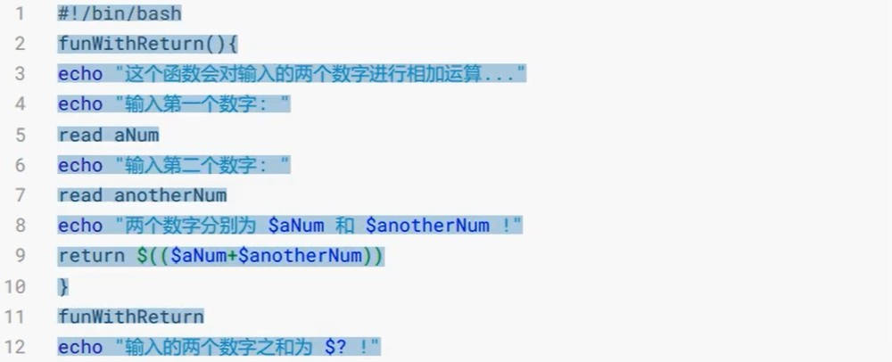

# Shell 编程增强

- 入门

```
# 创建 .sh 文件
vi hello.sh

#!/bin/bash
echo "hello world"

# 运行方法一
sh hello.sh

# 运行方法二
chmod +x ./*.sh
./*.sh
```

- 局部变量

```
str="hello"
echo $str
echo ${str}world
```

- 环境变量

- 特殊符号

</img>

- 运算符

```
a=1;
b=2;
echo `expr $a + $b`
echo $((a+b));
echo $[a+b];

# 乘号需要 \*
```

- 条件

</img>

- 循环

</img>

- 函数/过程

</img>


