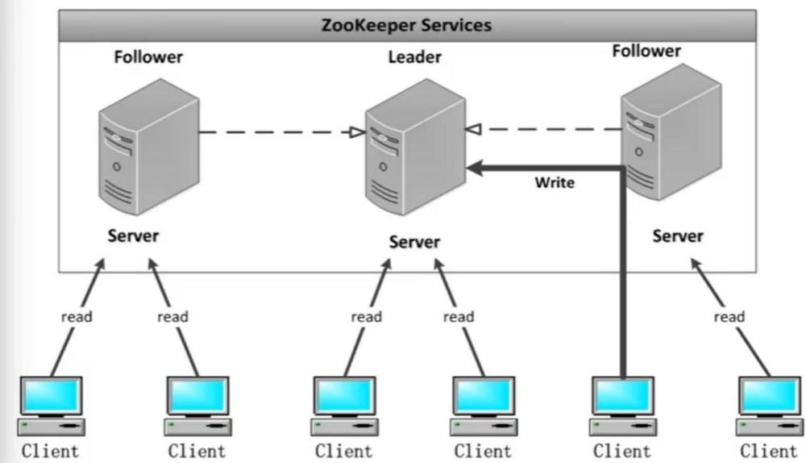
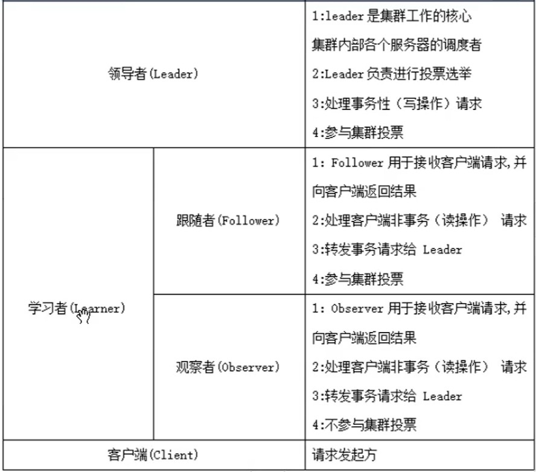
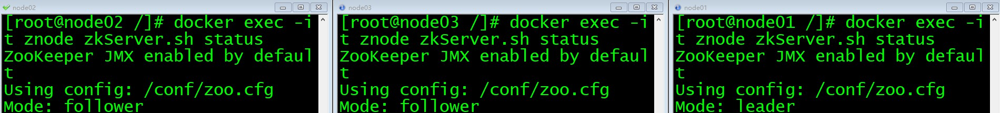

# Zookeeper

## 概述

- 定义：分布式协调服务框架，用于解决分布式系统一致性问题

- 本质：**分布式文件系统**，可以理解为一个数据库

- 应用场景

数据订阅/发布：推拉均可，节点可以被关注，节点改变时，客户可以收到通知。

命名服务

分布式协调通知：心跳检测、工作进度汇报、系统调度。（都是通过节点完成的）

分布式锁：写锁 /exclusive_lock/lock、读锁 /shared_lock/lock

分布式队列：任务按照顺序执行


## Znode：树型层级结构，即是文件夹，也可以存储数据

- 树形结构，根节点为 /
- 每个节点称为 Znode，可以拥有子节点
- Znode 兼具文件和目录的特点，既可以存数据，也可以作为路径标识
- Znode 数据容量 1 M （不应该存大量数据）
- 只允许绝对路径
- 默认存在路径 /zookeeper

### Znode 的 3 部分

- stat 状态信息，如版本，权限
- data 数据
- children 子节点

### Znode 节点类型

- 临时节点。声明周期基于会话，会话结束节点自动删除。**不能拥有子节点**。使用示例（watch机制和主机存活检查）
- 永久节点。生命周期不依赖于会话，只能被手动删除。
- 顺序序列。Znode 的一个机制，创建节点时，名字会再附上一个自增的序列号。


## 架构：主从架构

- 3 种角色 leader follower observer

</img>

可以看到，从主机可以处理 read，但是写请求都会转发给 leader

</img>

## leader 选举机制

- 时机：服务器启动、leader 挂了

## 默认端口

- 2181 对 client 提供服务（对外）
- 3888 选举 leader
- 2888 集群内通讯

# 安装配置 zookeeper

安装docker

```curl -sSL https://get.daocloud.io/docker | sh```

设置开机启动

```systemctl enable docker```

启动 docker

```systemctl start docker```

安装 zookeeper

```docker pull zookeeper:3.4```

创建挂载目录

```/export/servers/zookeeper/conf```

```/export/servers/zookeeper/data```

在 conf 下创建配置文件 zoo.cfg

```
clientPort=2181 
dataDir=/data 
dataLogDir=/data/log 
tickTime=2000 
initLimit=5 
syncLimit=2 
autopurge.snapRetainCount=3 
autopurge.purgeInterval=0 
maxClientCnxns=60 
server.1=node01:2888:3888 
server.2=node02:2888:3888 
server.3=node03:2888:3888
```

在 data 目录下创建 myid 配置 id，注意必须和配置文件中 ```server.``` 后面的数字相同

```echo 1 > myid```

```echo 2 > myid```

```echo 3 > myid```


启动 zookeeper

```shell
docker run --privileged --network host \
-v /export/servers/zookeeper/data:/data \
-v /export/servers/zookeeper/conf:/conf \
--name znode -d zookeeper:3.4

# --privileged 使用该参数，container内的root拥有真正的root权限
# --network host: 使用主机上的网络配置，如果不用这种模式，而用默认的bridge模式，会导致容器跨主机间通信失败
# 都启动完成后，每台主机的2181/2888/3888端口都会开放出来了
```

查看级群状态

```docker exec -it znode zkServer.sh status```

进入zkcli

```docker exec -it znode zkCli.sh -server node02:2181```

</img>


## zkcli 常用命令

创建 znode

```
create [-s] [-e] path data acl

-s 顺序节点 -e 临时节点 data 携带参数 acl 权限控制

create /hello world # 节点名/hellow 数据 world
```

查看节点

```
ls

ls / # 查看根节点下所有节点信息
```

修改节点数据

```
set path data
```

