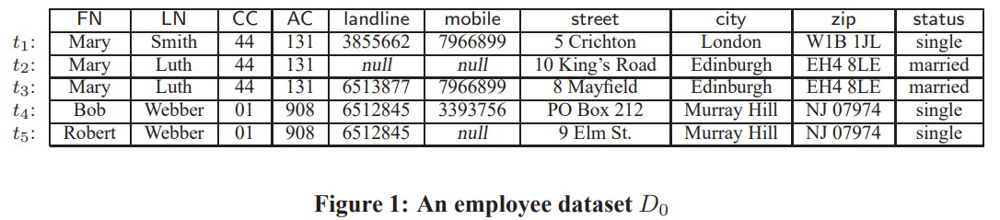
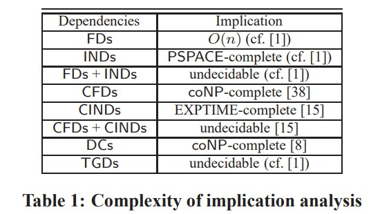
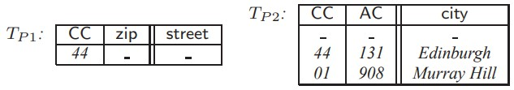
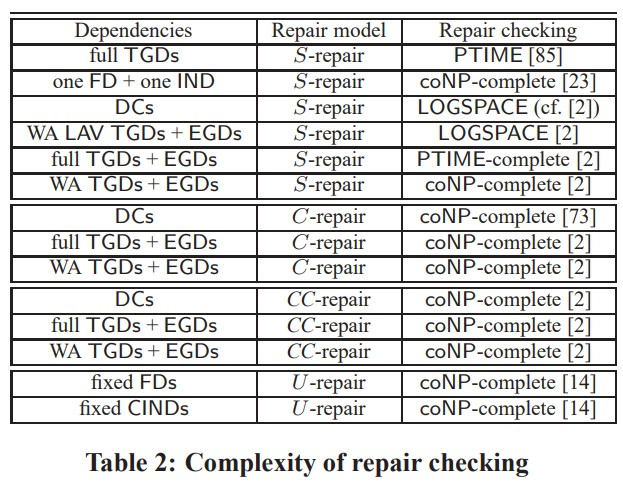
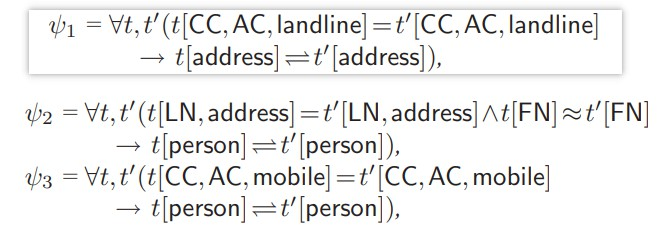

# Data Quality: From Theory to Practice

Wenfei Fan

School of Informatics, University of Edinburgh, and RCBD, Beihang University wenfei@inf.ed.ac.uk

## 摘要

Data quantity and data quality 数据量和数据质量, like two sides of a coin, are equally important to data management. This paper provides an overview of recent advances in the study of data quality, from theory to practice. We also address challenges introduced by big data to data quality management.

## 1. INTRODUCTION

When we talk about big data, we typically emphasize the quantity (volume) of the data. We often focus on techniques that allow us to efficiently store, manage and query the data. For example, there has been a host of work on developing scalable algorithms that, given a query Q and a dataset D, compute query answers Q(D) when D is big.

谈起大数据，一般强调数据的量。重视对数据的存储、管理、查询，开发可伸缩的查询算法。查询 Q，对于数据 D，结果 Q(D)

But can we trust Q(D) as correct query answers? 

怎么确定 Q(D) 的正确性？

EXAMPLE 1. In table D0 of Fig. 1, each tuple specifies the name (FN, LN), phone (country code CC, area code AC, landline, mobile), address (street, city and zip), and marital status of an employee. Consider the following queries.

</img>

(1) Query Q1 is to find distinct employees in Edinburgh whose first name is Mary. A textbook answer to Q1 in D0 is that Q1(D0) consists of tuples t2 and t3.

Q1 查询职位地 Edinburgh 姓 Mary 的人，Q1(D0)={t2,t3}

However, there are at least three reasons that discredit怀疑 our trust in Q1(D0). (a) In tuple t1, attribute t1[AC] is 131, which is the area code of Edinburgh, not of London. Hence t1 is “inconsistent”, and t1[city] may actually be Edinburgh. (b) Tuples t2 and t3 may refer to the same person, i.e., they may not be “distinct”. (c) Relation D0 may be incomplete: there are possibly employees in Edinburgh whose records are not included in D0. In light of these, we do not know whether Q1(D0) gives us all correct answers.

可以不信任 Q1(D0)={t2,t3}，三个理由 1 t1 的数据不一致；2 t2/t3 可能是同一个人；3 表 D0 可能不完整。

(2) Suppose that t1,t2 and t3 refer to the same Mary, and that they were once correct records (except the address of t1). Query Q2 is to find her current last name. It is not clear whether the answer is Smith or Luth. Indeed, some attributes of t1,t2 and t3 have become obsolete and thus inaccurate. 

假设 t1 t2 t3 是同一个人，每条记录仅仅是某一时刻正确值。查询 Q2 去找到她真正的名（last name）。那么我不清楚是 Smith 还是 Luth。实际上，t1，t2和t3的某些属性已过时，因此不准确。

The example shows that if the quality of the data is bad, we cannot find correct query answers no matter how scalable and efficient our query evaluation algorithms are.

这个例子指出，如果一个数据的质量很差，无法找到正确的查询结果。

Unfortunately, real-life data is often dirty: inconsistent, inaccurate, incomplete, obsolete and duplicated. Indeed, “more than 25% of critical关键 data in the world’s top companies is flawed” [53], and “pieces of information perceived as being needed for clinical decisions were missing from 13.6% to 81% of the time” [76]. It is also estimated that “2% of records in a customer file become obsolete in one month” [31] and hence, in a customer database, 50% of its records may be obsolete and inaccurate within two years.

不幸的是，真实世界的数据经常是脏的（不一致、不正确、不完整、过时、重复），“超过25%的关键数据有缺陷”，“数据大量丢失”。“客户档案中，每个月2%数据重复”——一年重复50%。

Dirty data is costly. Statistics shows that “bad data or poor data quality costs US businesses $600 billion annually” [31], “poor data can cost businesses 20%-35% of their operating revenue” [92], and that “poor data across businesses and the government costs the US economy $3.1 trillion a year” [92]. Worse still, when it comes to big data, the scale of the data quality problem is historically unprecedented.

脏数据花费大。统计表明“不好的数据导致美国企业损失6000亿美元每年”。相当于收入的20-35%。在大数据中，数据质量导致的问题不可预测。

These suggest that quantity and quality are equally important to big data, i.e., big data = data quantity + data quality

因此大数据中，数据的量和数据质量同等重要。

This paper aims to provide an overview of recent advances in the study of data quality, from fundamental research (Section 2) to practical techniques (Section 3). It also identifies challenges introduced by big data to data quality management (Section 4). Due to the space constraint由于篇幅所限, this is by no means a comprehensive survey. We opt for breadth rather than depth in the presentation. Nonetheless, we hope that the paper will incite interest in the study of data quality management for big data. We refer the interested reader to recent surveys on the subject [7, 11, 37, 52, 62, 78].

本文总结当前数据质量的研究。章 2 基础研究，章 3 技术实践。章 4 大数据和数据管理下的挑战。由于篇幅所限，这绝不是一项全面的调查。 在演示中，我们选择广度而不是深度。 尽管如此，我们希望本文能引起人们对大数据数据质量管理研究的兴趣。 我们请感兴趣的读者阅读有关该主题的最新调查。

## 2. FOUNDATIONS OF DATA QUALITY 基础研究

Central to data quality are data consistency, data deduplication, information completeness, data currency时效性？ and data accuracy. The study of data quality has been mostly focusing on data consistency and deduplication in relational data. Nonetheless, each and every of the five central issues introduces fundamental problems. In this section we survey fundamental research on these issues. We highlight dependency-based approaches since they may yield a uniform logical framework to handle these issues.

主要关注：关系型数据、一致性、重复性。（一致性，重复性，完整性，时效性？和准确性）
使用 dependency-based 的方法。

## 2.1 Data Consistency 一致性

Data consistency refers to the validity and integrity of data representing real-world entities. It aims to detect errors (inconsistencies and conflicts) in the data, typically identified识别标记 as violations of data dependencies (integrity constraints). It is also to help us repair the data by fixing the errors. There are at least two questions associated with data consistency. What data dependencies should we use to detect errors? What repair model do we adopt to fix the errors?

数据一致性 = 有效性 + 完整性。我们需要发现数据中的错误（不一致、冲突），进行冲突标记。甚至修复数据。
两个问题：基于怎样的数据关系来发现错误、怎样的修复手段（模型）

**Data dependencies**. Several classes of data dependencies have been studied as data quality rules, including

- functional dependencies (FDs) and inclusion dependencies (INDs) [14, 23] found in textbooks (e.g., [1]);

- conditional functional dependencies (CFDs) [38] and conditional inclusion dependencies (CINDs) [15], which extend FDs and INDs, respectively, with a pattern tableau of semantically related constants;

- denial constraints (DCs) [8, 23], which are universally quantified first-order logic (FO) sentences of the form ∀x¯¬(φ(¯x)∧β(¯x)), where φ(¯x) is a non-empty conjunction of relation atoms over x¯, and β(¯x) is a conjunction of built-in predicates =,6=,<,>,≤,≥;

- equality-generating dependencies [2] (EGDs [9]), a special case of DCs when β(¯x) is of the form xi =xj ; our familiar FDs are a special case of EGDs; tuple-generating dependencies [2] (TGDs [9]), FO sentences of the form ∀x¯(φ(¯x)→∃y¯(ψ(¯x,y¯)), where φ(¯x) and ψ(¯x,y¯) are conjunctions of relation atoms over x¯ and x¯∪y¯, respectively, such that each variable of x¯ occurs in at least one relation atom of φ(¯x);

- full TGDs [2], special case of TGDs without existential quantifiers, i.e., of the form ∀x¯(φ(¯x)→ ψ(¯x)); and

- LAV TGDs [2], a special case of TGDs in which φ(¯x) is a single relation atom; LAV TGDs subsume INDs.

</img>

EXAMPLE 2. We may use the following CFDs as data quality rules on the employee relation of Figure 1:

φ1 = ((CC, zip -> street), Tp1)
φ2 = ((CC, AC -> city), Tp2)

where CC,zip→street and CC,AC→city are FDs embedded in the CFDs, and TP 1 and TP 2 are pattern tableaux:

</img>

CFD ϕ1 states that in the UK (when CC = 44), zip code uniquely determines street. In other words, CC,zip→ street is an FD that is enforced only on tuples that match the pattern CC = 44, e.g., on t1–t3 in D0, but not on t4–t5. Taking ϕ as a data quality rule, we find that t2 and t3 violate ϕ1 and hence, are inconsistent: they have the same zip but differ in street. Such errors cannot be caught by conventional FDs.

CFD ϕ1指出，在英国（CC = 44时），邮政编码唯一地确定街道。 换句话说，CC，zip→street是仅在匹配模式CC = 44的元组上强制执行的FD，例如，在D0中的t1-t3上，而不是t4-t5上。 以ϕ作为数据质量规则，我们发现t2和t3违反ϕ1，因此不一致：它们的邮编相同，但街道不同。 常规FD无法捕获此类错误。

CFD ϕ2 says that country code CC and area code AC uniquely determine city. Moreover, in the UK (i.e., CC = 44), when AC is 131, city must be Edinburgh; and in the US (CC = 01), if AC is 908, then city is Murray Hill. It catches t1 as a violation, i.e., a single tuple may violate a CFD. Note that ϕ2 subsumes conventional FD CC,AC→city, as indicated by the first tuple in TP 2, in which ‘ ’ is a “wildcard” that matches any value (see [38] for details). 

CFD ϕ2表示国家代码CC和地区代码AC唯一确定城市。 此外，在英国（CC = 44），当AC为131时，城市必须为爱丁堡； 在美国（CC = 01），如果AC为908，则城市为Murray Hill。 它将t1视为违规，即单个元组可能违反CFD。 请注意，ϕ2包含常规的FD CC，AC→city，如TP 2中的第一个元组所示，其中“”是匹配任何值的“通配符”（有关详细信息，请参见[38]）。

To decide what class of dependencies we should use as data quality rules, we want to strike a balance between its “expressive power”, i.e., whether it is capable of catching errors commonly found in practice, and the complexity for reasoning about its dependencies and for repairing data.

为了决定我们应该使用哪种依赖关系作为数据质量规则，我们希望在它的“表达能力”（即它是否能够捕获实践中常见的错误）与推理依赖关系的复杂性之间取得平衡。 用于修复数据。

There are two classical problems for reasoning about dependencies: the satisfiability and implication problems.

关于依赖关系的推理有两个经典问题：可满足性和隐含性问题。

Satisfiability. For a class C of dependencies and ϕ∈C, we use D |=ϕ to denote that a database D satisfies ϕ, depending on how C is defined. For a set Σ⊆ C, we use D |=Σ to denote that D satisfies all dependencies in Σ. The satisfiability problem for C is to decide, given a finite set Σ⊆ C defined on a relational schema R, whether there exists a nonempty finite instance D of R such that D |=Σ. That is, whether the data quality rules in Σ are consistent themselves.

可满足性。 对于依赖项和ϕ∈C的类C，我们使用D | = ϕ表示数据库D满足ϕ，具体取决于C的定义方式。 对于集合⊆C，我们使用D | =Σ表示D满足Σ中的所有依赖关系。 C的可满足性问题是，给定在关系模式R上定义的有限集∑⊆ C，确定是否存在R的非空有限实例D使得D | =Σ。 也就是说，Σ中的数据质量规则本身是否一致。

We can specify arbitrary FDs without worrying about their satisfiability. Indeed, every set of EGDs (or TGDs) can be satisfied by a single-tuple relation [8]. However, a set of DCs or CFDs may not be satisfiable by a nonempty database. While the satisfiability problem for DCs has not been settled, it is known that it is NPcomplete for CFDs [38], owing to the constant patterns in CFDs. That is, the expressive power of CFDs and DCs come at a price of a higher complexity

我们可以指定任意FD，而不必担心它们的可满足性。 确实，每组EGD（或TGD）都可以通过单元组关系来满足[8]。 但是，非空数据库可能无法满足一组DC或CFD。 尽管DC的可满足性问题尚未解决，但众所周知，由于CFD的模式不变，它对于CFD来说是NPcomplete [38]。 也就是说，CFD和DC的表达能力以更高的复杂性为代价。

Implication. Consider a finite set Σ⊆ C of dependencies and another ϕ∈C, both defined on instances of a relational schema R. We say that Σ implies ϕ, denoted by Σ|=ϕ, if for all instances D of R, D |=ϕ as long as D |=Σ. The implication problem for C is to decide, given Σ⊆ C and ϕ∈C over a relational schema R, whether Σ|=ϕ. The implication analysis helps us remove redundant data quality rules and hence, speed up error detection and data repairing processes.

隐含性。考虑依赖项的一个有限集合Σ⊆C和另一个ϕ∈C，它们都在关系模式R的实例上定义。我们说，如果对于R的所有实例D，D | =，则Σ隐含ϕ，用Σ| = ϕ表示。 D只要D | =Σ。 对于C的隐含问题是，在关系模式R上给定Σ⊆C和ϕ∈C的情况下，确定Σ| = ϕ。 隐含分析有助于我们删除冗余的数据质量规则，从而加快错误检测和数据修复过程。

Table 1 summarizes known complexity of the implication analysis of data dependencies used as data quality rules.

表1总结了用作数据质量规则的数据依赖关系的隐含分析的已知复杂性。

Data repairing. There are two approaches to obtaining consistent information from an inconsistent database, both proposed by [6]: data repairing is to find another database that is consistent and minimally differs from the original database; and consistent query answering is to find an answer to a given query in every repair of the original database. Both approaches are based on the notion of repairs. We focus on data repairing in this paper, and refer the interested reader to a comprehensive survey [11] and recent work [12, 67, 86, 87] on consistent query answering.

数据修复。 [6]提出了两种从不一致的数据库中获取一致信息的方法：数据修复是寻找另一个与原始数据库一致且差异最小的数据库； 一致的查询回答是在原始数据库的每次修复中找到给定查询的答案。 两种方法都基于维修的概念。 在本文中，我们将重点放在数据修复上，并让感兴趣的读者阅读有关一致性查询回答的全面调查[11]和近期的工作[12，67，86，87]。

Repair models. Assume a function cost(D,Dr) that measures the difference between instances D and Dr of a relational schema R, such that the smaller it is, the closer Dr is to D. Given a set Σ of dependencies and an instance D of R, a repair of D relative to Σ and cost(,) is an instance Dr of R such that Dr |=Σ and cost(D,Dr) is minimum among all instances of R that satisfy Σ. Several repair models have been studied, based on how cost(D,Dr) is defined:

**维修模型**（即怎么修复数据）。 假设一个函数cost（D，Dr）度量关系模式R的实例D和Dr之间的差，函数值越小，Dr越接近D。给定一组依赖关系Σ和R的实例D ，D相对于Σ和cost（，）的修复是R的实例Dr，使得在满足Σ的R的所有实例中，Dr | =Σ且cost（D，Dr）最小。 基于如何定义成本（D，Dr），研究了几种修复模型：
（这段话我看懂了！！关系 R 的实际表 D，进行修复得到 Dr，使得 Dr不会完全满足依赖关系 Σ，同时 D 和 Dr 的差距最小）

- S-repair [23]: cost(D,Dr) = |D\Dr|, where Dr ⊆D; assuming that the information in D is inconsistent but complete, this model allows tuple deletions only;

- C-repair [6]: cost(D,Dr) = |D⊕Dr|, where D⊕ Dr is defined as (D\Dr)∪(Dr \D); assuming that D is neither consistent nor complete, this model allows both tuple deletions and tuple insertions;

- CC-repair [2]: a C-repair such that |D⊕Dr| is strictly smaller than |D⊕D′ r | for all D′ r that satisfies Σ; and

- U-repair [91, 14]: cost(D,Dr) is a numerical aggregation function defined in terms of distances and accuracy of attribute values in D and Dr; this model supports attribute value modifications.

For example, the repair model of [14] assumes (a) a weight w(t,A) associated with each attribute A of each tuple t in D, and (b) a distance function dis(v,v′ ) for values v and v ′ in the same domain. Intuitively, w(t,A) indicates the confidence置信度 in the accuracy of t[A], and dis(v,v′ ) measures how close v ′ is to v. The cost of changing the value of an attribute t[A] from v to v ′ is defined as: cost(v,v′ )=w(t,A)·dis(v,v′ ). That is, the more accurate the original t[A] value v is and the more distant the new value v ′ is from v, the higher the cost of the change is. The cost of changing a tuple t to t ′ is the sum of cost(t[A],t′ [A]) for A ranging over all attributes in t in which the value of t[A] is modified. The cost of changing D to Dr, denoted by cost(D,Dr), is the sum of the costs of modifying tuples in D. In practice, repairing is typically carried out via U-repair (see Section 3).

（介绍一个修复模型）
例如，[14]的修复模型假设（a）与D中每个元组t的每个属性A相关联的权重w（t，A），以及（b）值的距离函数dis（v，v'） v和v'在同一域中。 直观地，w（t，A）表示对t [A]的准确度的置信度，而dis（v，v'）表示v'与v的接近程度。更改属性t [A]的值的成本 从v到v'的定义为：cost（v，v'）= w（t，A）·dis（v，v'）。 也就是说，原始t [A]值v越精确，新值v'与v距离越远，更改的成本就越高。 将元组t更改为t'的成本是A的成本（t [A]，t'[A]）的总和，范围为t的所有属性，其中t [A]的值被修改。 将D更改为Dr的成本，用cost（D，Dr）表示，是在D中修改元组的成本之和。实际上，修复通常是通过U-repair进行的（请参见第3节）。

**The repair checking problem**. Consider a class C of dependencies and a repair model T with which function costT (,) is associated. The repair checking problem for (C,T ) is to decide, given a finite set Σ⊆ C of dependencies defined over a relational schema R, and two instances D and Dr of R, whether Dr is a repair of D relative to Σ and costT (,)?

**维修检查问题**。 考虑依赖关系的类C和与功能costT（，）相关联的修复模型T。 给定（C，T）的修复检查问题，要确定给定在关系模式R上定义的依赖项的有限集合∑⊆ C和R的两个实例D和Dr的情况下，Dr是否是相对于Σ和D的D的修复 costT（，）？
（给定关系下，检查 Dr 是不是 D 的修复）

The repair checking problem has been studied for various dependencies and repair models; some of the complexity bounds are presented in Table 2. Here a set of TGDs is said to be weakly acyclic (WA) if its dependency graph does not have a cycle going through a special edge that indicates an existentially quantified variable in Σ (see [2] for details).

已针对各种依赖关系和修复模型研究了修复检查问题； 表2列出了一些复杂性界限。如果一组TGD的依存关系图没有一个循环经过一个特殊的边来表示Σ中存在量化的变量，则这组TGD被称为弱非循环（WA）。 2]）。

Table 2 tells us that data repairing is rather expensive, especially for U-repair when attribute values are allowed to be updated: following [14], one can show that its data complexity is already intractable when only FDs or INDs are used.

表2告诉我们，数据修复是相当昂贵的，特别是对于允许更新属性值的U-repair：根据[14]，可以证明，仅使用FD或IND时，其数据复杂性已经难以捉摸。

</img>

## 2.2 Data Deduplication 数据去重

Data deduplication is the problem of identifying tuples from one or more (possibly unreliable) relations that refer to the same real-world entity. It is also known as record matching, record linkage, entity resolution, instance identification, duplicate identification, merge-purge, database hardening, name matching, coreference resolution, identity uncertainty, and object identification. It is a longstanding issue that has been studied for decades [49], and is perhaps the most extensively studied data quality problem.

重复数据删除是从一个或多个引用同一真实世界实体的关系中识别元组的问题。 它也称为记录匹配，记录链接，实体解析，实例标识，重复标识，合并清除，数据库强化，名称匹配，共指解析，身份不确定性和对象标识。 这是一个已经研究了数十年的长期问题[49]，**也许是研究最广泛的数据质量问题**。

The need for data deduplication is evident in, e.g., data quality management, data integration and fraud detection. It is particularly important to big data, which is often characterized by a large number of (heterogeneous) data sources. To make practical use of the data, it is often necessary to accurately identify tuples from different sources that refer to the same entity, so that we can fuse the data and enhance the information about the entity. This is nontrivial: data from various sources may be dirty, and moreover, even when the data sources are seemingly reliable, inconsistencies and conflicts often emerge when we integrate the data [14].

（数据去重的意义）在例如数据质量管理，数据集成和欺诈检测中明显需要重复数据删除。 这对于大数据尤其重要，大数据通常具有大量（异构）数据源。 为了实际使用数据，通常需要准确地标识来自引用同一实体的不同来源的元组，以便我们可以融合数据并增强有关实体的信息。 这是不平凡的：来自各种来源的数据可能是肮脏的，而且，即使数据来源看似可靠，我们整合数据时也经常会出现不一致和冲突的情况[14]。

A variety of approaches have been proposed for data deduplication: probabilistic (e.g., [49, 65, 95]), learning-based [27, 82], distance-based [60], and rulebased [3, 44, 61] (see [33, 62, 78] for surveys). In this paper we focus on rule-based collective and collaborative deduplication.

已经提出了多种方法来进行重复数据删除：概率（例如[49，65，95]），基于学习的[27，82]，基于距离的[60]和基于规则的[3，44，61]（ 参见[33、62、78]。 在本文中，我们专注于基于规则的集体和协作重复数据删除。

Data deduplication. To simplify the discussion, consider a single relation schema R. This does not lose generality since for any relational schema R= (R1,...,Rn), one can construct a single relation schema R and a linear bijective function f()from instances of R to instances of R, without loss of information. Consider a set E of entity types, each specified by e[X], where X is a set of attributes of R.

重复数据删除。 为了简化讨论，请考虑单个关系模式R。这不会失去普遍性，因为对于任何关系模式R =（R1，...，Rn），可以构造单个关系模式R和线性双射函数f（） 从R实例到R实例，而不会丢失信息。 考虑实体类型的集合E，每个实体类型由e [X]指定，其中X是R的属性集合。

Given an instance D of R and a set E of entity types, data deduplication is to determine, for all tuples t,t′ in D, and for each entity type e[X], whether t[X] and t ′ [X] should be identified, i.e., they refer to the same entity of type e. Following [13], we call t[X] and t ′ [X] references to e entities.

给定R的实例D和实体类型的集合E，重复数据删除将针对D中的所有元组t，t'和每个实体类型e[X]确定t[X]和t'[X]应被标识，即它们指的是类型e的同一实体。 在[13]之后，我们称t[X]和t'[X]对e实体的引用。

EXAMPLE 3. On the employee relation of Figure 1, we may consider two entity types: address specified by (CC,street,city,zip), and person as the list of all attributes of employee. Given employee tuples t and t ′ , deduplication is to decide whether t[address] and t ′ [address] refer to the same address, and whether t and t ′ are the same person. 

例3.在图1的雇员关系中，我们可以考虑两种实体类型：（CC，街道，城市，邮编）指定的地址，以及人员作为雇员所有属性的列表。 给定员工元组t和t'，重复数据删除将确定t [address]和t'[address]是否引用相同的地址，以及t和t'是否是同一个人。

As observed in [13], references to different entities may co-occur, and entities for co-occurring references should be determined jointly. For instance, papers and authors co-occur; identifying two authors helps identify their papers, and vice versa. This is referred to as collective entity resolution (deduplication) [13]. A graphbased method is proposed in [13] to propagate similarity among references, for collective deduplication. A datalog-like language is introduced in [5], with recursive rules for collective deduplication.

正如在[13]中观察到的，可能会同时出现对不同实体的引用，并且应该共同确定用于同时出现的引用的实体。 例如，论文和作者并存； 确定两位作者有助于确定他们的论文，反之亦然。 这称为集体实体解析（重复数据删除）[13]。 在[13]中提出了一种基于图的方法来传播参考之间的相似性，以实现集体重复数据删除。 [5]中介绍了一种类似于数据日志的语言，其中包含用于重复数据删除的递归规则。

Matching rules. Rules were first studied in [3] for deduplication. Extending [3], a class of matching dependenciesis defined in [44] in terms of similarity predicates and a matching operator ⇋, based on a dynamic semantics [34].

匹配规则。 规则首先在[3]中研究了重复数据删除。 扩展[3]，在[44]中根据动态语义[34]，根据相似性谓词和匹配运算符defined定义了一类匹配依赖项。

EXAMPLE 4. Matching dependencies on the employee relation of Figure 1 include the following:

</img>