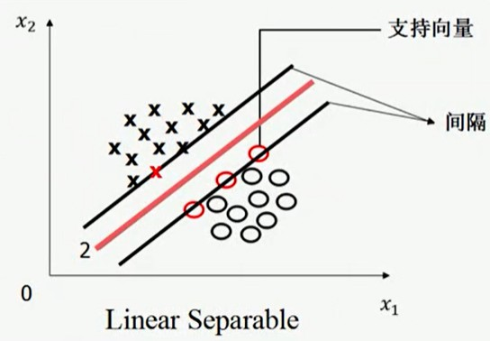
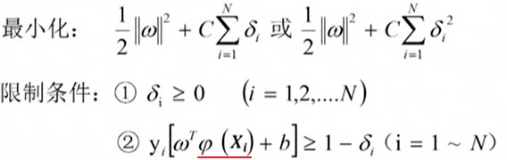

## 线性可分/不可分

- 前提，样本数据集存在标签，且标签是二元的。

- 线性可分/不可分。图象直观描述如下。推广到多维，即可用超平面分开。

</img>

- 二维描述。注意其中变量名字：权重、偏置

</img>

- 严格定义。训练样本 {(Xi,yi)}，线性可分则 yi(wTXi+b)>0

```
Xi 表示第 i 个数据的特征向量，如 (12岁,40kg)
yi 表示第 i 个数据的标签，只有 -1/1 两种取值，如 1 表示健康，-1 表示不健康
w 是特征的权重向量，如 (2,3)，wT 表示 w 的转置
b 是偏置

Xi，yi 已知，w 和 b 待求解
```

## 最优分割平面

- **如果一个数据集是线性可分的，即存在一个超平面可以把两个类别完全分开，则一定存在无穷多个超平面把两个类别完全分开**，问题：哪个分割平面是最优的呢？

</img>

首先定义**间隔**，任意一个可以进行分割的平面，对它进行平移（向上向下，只有两个方向），直到碰到样本点，碰到 X 的直线和碰到 O 的直线，两者距离就是 间隔。

直线平移时碰到的样本点，称为**支持向量**。

由此定义最优分割直线：1.能最大化间隔；2.位于间隔的中心。

- 最优分割平面是唯一的。

## 寻找最优分割平面

- 基础：点到 X0 超平面 wTX+b=0 的距离 d = |wTXo0+b| / len(w)

- 基础：超平面 wTX+b=0 和 超平面 awTX+ab=0，a ≠ 0，表示同一个超平面。（n 维空间中超平面的自由度只有 n 个，而不是 n-1 ）

- 因此，可以选取某个超平面方程，使得 支持向量 X0 的 wTX0+b==1，则

</img>

- 问题变为最小化 len(w)，再转为最小化 0.5*w^2，因为求导更方便。

- 另外限制条件则是 yi(wTXi + b)>=1 ,因为小于等于 1 意味着在支持向量的平面内。
 
</img>

- 这是一个二次规划问题。目标函数是二次项，限制条件是一次项。因此要么无解，要么只有唯一解。这也是一个凸优化问题，只有全局最小值，利用梯度下降求解。（只要一个优化问题是凸的，则总能找到高效算法求解）

```
本课程不详细讨论怎么求解凸优化问题
只规定只要问题可以转为凸优化，就能快速解出
求解凸优化问题是个专门课程
```

## 线性不可分 01 -- 松弛变量 δ

- 线性不可分情况下，前面的算法无解。

- 放宽限制条件，每个样本引入松弛变量 δi，slack variable。限制条件改为 yi(wTXi + b)>=1-δi

- 原本最小化 0.5*w^2，这时也要对 δi 优化，因此变为 0.5*w^2 + CΣδi ，或者 0.5*w^2 + CΣ(δi^2)。其中 C 是比例因子，平衡 w 和 δ 的权重，是人为设定的，是一个超参数 hyper parameter。整体如下

</img>

- 改动后，仍然是凸优化问题，可以高效求解

- C 是一个超参数，因此需要不断调整 C 让算法识别率达到最高。（支持向量机，是一个超参数很少的模式，而神经网络超参数很多）

## 线性不可分 02 -- φ(X) 低维映射到高维

- 如果分割函数仍是线性的（直线、平面、超平面），则即时引入松弛变量也无法解决下图问题。

</img>

- 一般两种解决方案：

1. 增加可选函数，如利用曲线、曲面进行分割。
2. 2.对 xi 进行变换，将问题转为线性可分，如上图变为 (x1^2+kx2^2) 则问题变为一维线性分割问题。

- 支持向量机，通过将**特征空间**从低维映射到高维，仍用超平面分割数据。

```
比如考察 4 个点
(0,0)，(1,1) 属于  1，标记为 O
(1,0)，(1,0) 属于 -1，标记为 X

如下图：

1  X  O
|
0  O  X
|
---0--1

很明显在二维中这 4 个点线性不可分
构造二维到 5 维的映射：φ(x,y)->(x^2,y^2,x,y,xy)
则这 4 个点在 5 维中线性可分
```

- 定理：M 维空间上的 N 个训练样本，随机赋予标签 1 和 -1，设线性可分的概率为 P(M,N)，则 lim(M->∞)P(M,N)->1
  
证明略，直观理解：维度增加时，w 向量长度增加，即自由度增加了，所以更容易线性分割数据

- 综上，带有松弛变量和高维映射的优化问题变为如下形式：

</img>

## 核函数

- 带有松弛变量和高维映射的优化问题变成了高维映射 φ(X) 怎么取的问题。

- 定义核函数 K(X1,X2) = φ(X1)T * φ(X2)，这一个标量。可以不用知道 φ(X) 的具体性质，完成支持向量机问题求解。

```
核函数 K(X1,X2) 和高维映射 φ(X)，是一一对应的
核函数 K(X1,X2) 需要满足一定条件
1. 交换性。K(X1,X2) == K(X2,X1)
2. 半正定性.任意的 Ci、Cj，有 ΣΣCiCjK(Xi,Xj) ≥ 0
```

## 泛化 原问题和对偶问题

- 回顾：朗格朗日乘子法。

```
有 k 个变量和 m 个约束条件的极值问题，可以转为 k+m 个无约束的极值问题
即，原问题是
  min f(X), X k维度
  s.t. hi(X) = 0, i=1-m
可以消元法求解，也可以构建朗格朗日函数。

拉格朗日函数：
F(X,λ)=f(X)+Σλihi(X), λ m维度
问题中不再有约束，另所有变量偏导为0
∂F/∂Xi = 0
∂F/∂λi = 0

# 注 s.t. 表示 subject to
```

- KKT 条件。可以看作 朗格朗日乘子法 在不等式约束下的推广。

https://blog.csdn.net/johnnyconstantine/article/details/46335763

```
有 k 个变量和 m 个等式约束条件和 n 个不等式约束条件的极值问题
  min f(X), X k维度
  s.t. hi(X) = 0, i=1-m
       gj(X) ≤ 0, j=1-n

设问题的解为 X*，则
1. 当 gj(X*)<0 时，约束条件 gj 是无效的
2. 当 gj(X*)=0 时，约束条件 gj 是有效的

因此当 gj 无效时，可以删去，乘以任意系数 μgj(X) 可以设为 0
当 gj 有效时，退化为等式约束条件 μ

因此同样构建拉格朗日函数
F(X,λ)=f(X)+Σλihi(X)+Σμjgj(X))

除了之前的
∂F/∂Xi = 0
∂F/∂λi = 0
外，再补上
μjgj(X)=0 #互补松弛条件

因为 μj 为 0 时，说明约束无效，gj(X) 为零说明是等式约束
```

**注意：一般问题中，KKT 是最优解的必要条件，而凸问题中，KKT 是充分条件**

- 原问题和对偶问题。原问题的 KKT 条件称为其对偶问题，并求解（求解就是令变量的导数为0）


- 对偶问题的求解

1. 公式中 φ(Xi)Tφ(Xj)==K(Xi,Xj)，就是核函数

2. 首先求出 **α**，是一个向量。

3. 然后求出 b


4. 得到 **α** 和 b 后，模型构建完成，预测规则如下


## 实际应用中的一些问题

- **样本归一化**，防止不同维度范围的不同。一般采用均值方差归一化法 (原值-均值)/方差

- **使用 LIBSVM 工具包**，可以求解支持向量机

- **核函数的选取**：线性核（无意义）、多项式核（维度可调）、高斯径向基函数核（无限维度）、sigmoid核

- **交叉验证**：搜索合适的超参数值 C γ

## 度量系统/模型性能

- 数据识别率的高低和数据分布有关。单纯利用识别率判断模型好坏没有意义。

```
例如：人脸识别准确率 99%，这个是高还是低？
如果火车站有 1% 的人冒用身份证，人脸识别系统采用全部通过的方法，则识别率也是 99%
```

- 混淆矩阵


识别率：(TP+TN)/(TP+TN+FP+FN)

全部猜负样本时的识别率：(FN+TN)/(TP+TN+FP+FN)

## ROC 曲线 FP-TP 曲线


- 首先对混淆矩阵按行归一化：TP+FN=1，FP+FN=1

- TP 增加时，FP也会增加，因为要将更多的正样本识别为正样本，则势必会将更多的负样本识别为正样本

- ROC 曲线定义计算方法。每个系统都有自己的 ROC 曲线，计算每个数据的 Σαiyi(xi,x)+b 值，并当作阈值 b，计算它们的 TP-FP 并绘图。

- AUC == ROC 曲线积分面积，越大则系统性能越好

- ERR == (直线 x+y=1 和 ROC 曲线交点的横坐标)，越小越好

## 支持向量机求解多分类问题

- 1 类对 k-1 类

缺点：训练样本数量不平衡

- 1 类对 另 1 类

缺点：分类器太多

- 树型分类器