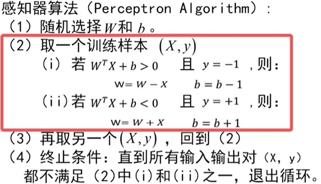
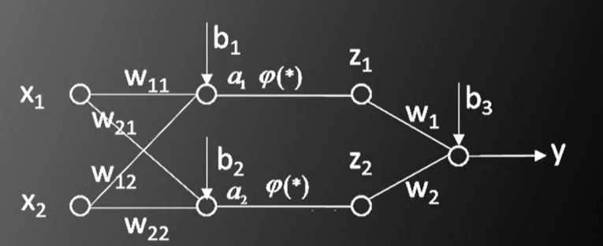
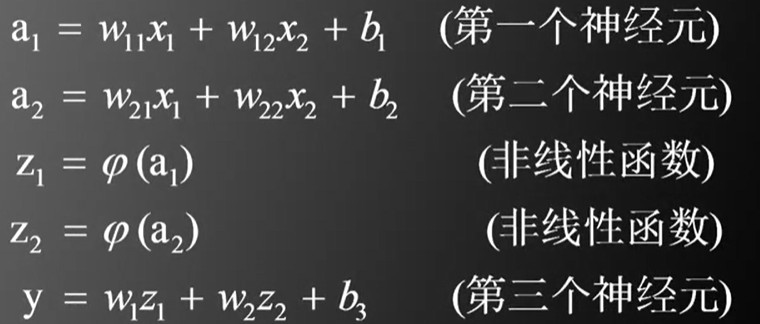
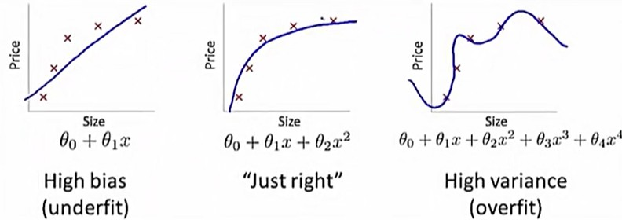

## 杂谈

- 仿生派：认为先研究清楚大脑机制，然后编程模拟，才能实现人工智能

- 数理学派：认为通过数理知识，就可以实现人工智能

## MP模型


xi 是 m 个输入
wi 是对输入的加权处理
b 是偏置
φ() 是激活函数

## 感知器算法

- 当 WTXi+b>0 且 yi=1 时，称数据 Xi,yi 是平衡的。同理 WTXi+b<0 且 yi=-1 时，也是平衡。否则数据不平衡。利用下面的算法，可以找到让所有数据平衡的 W 和 b



- 以上的循环算法，可以让 W 和 b 更接近解

- 有结论**只要数据线性可分，则循环一定能停止**。

- 感知器算法和支持向量机的区别。

```
1. 支持向量机可以找到最佳划分的 W b，感知器不行。
2. 支持向量机计算时需要涉及全部数据（需要巨大内存），但感知器是每次随机选取（消耗的内存少）。

感知器算法已经不再使用。
每次只送入少量数据，继续循环训练的算法，越来越适合现在巨量的数据。
```

 ## 人工神经网络第一次寒冬

 1. 50年代，提出人工神经网络模型的感知器算法
 2. 60-80年代，人们发现大量的问题不是线性可分的，因此神经网络无人问津
 3. 80年代初，多层神经网络诞生，初步解决线性不可分问题
 4. 90年代，支持向量机

## 三层神经网络可以模拟任意非线性函数

- 最简单的三层神经网络，图中均为标量





- 图中**非线性函数是必须**的，不然多层神经网络就会退化为单一神经元

- **非线性函数是阶跃函数，这样三层神经网络可以模拟任意非线性函数**（只要神经元足够多）

- 遗留的问题：对于具体问题，应该选择怎样的神经网络呢（网络层数、每层神经元个数）？回答：没有答案，只能估计

## 梯度下降

- 假设神经网络的结构已经确定，之后需要确定网络的参数。这是一个非凸函数，所以无法求出全局最优，一般使用梯度下降法求局部最优。（就是一个迭代）

- 梯度下降法，超参数：学习速率。


## 后向传播算法

- 神经网络中，参数很多，如果一次性求全部的偏导数，不是很好。利用神经网络的结构，可以发现参数的偏导数之间互相关联，利用链式求导法则，简化计算。

- 这种算法称为后向传播算法，因为是从后往前计算。

## 三大改进

- 阶跃函数不可导，需要换成其他的函数，如sigmoid函数（求导简单）、th函数（求导简单）

- 标签值 y 不再是 ±1，而是**独热向量**，[1, 0] 和 [0, 1]，对于 k 个类别，第 i 类即 [0..0, 1, 0..0]，i 位置为 1

- 目标函数不再是 0.5*len(y真实值-y预测值)，而是 SOFTMAX 和 交叉熵 cross-entropy，这样后向传播算法更简单。

- 随机梯度下降法。原梯度算法中，每次利用一个数据，就计算梯度更新所有的参数，这样单一变量影响太大。因此使用一批样本（50-200个数据）BATCH，求梯度平均值，再更新参数。

```
总的样本，一般均分为多个 BATCH，依次送入循环，当全部 BATCH 训练接受后，称为一个 EPOCH
每一个 EPOCH，打乱 BATCH
```

## 神经网络的训练是一门艺术

- 训练集上目标函数的平均值，会随着训练不断减小，如果增大，则说明训练结束，或者模型不够复杂。

- 需要验证集，训练一段时间后，需要在验证机上测试识别率。

- 注意调节学习率。

- 目标函数可以增加正则项， + len(W)

- 训练数据归一化。

- 注意参数 W 和 b 初始化。梯度消失问题：激活函数在远离 0 的地方，梯度很小。因此 WTX+b 应落在 0 附近。

- 梯度的绝对值有大有小 ADAGRAD，BATCH 不同导致梯度方向随机化，引入动量概念。

## 补充

- 欠拟合、过拟合。当预测函数变量少于数据集大小时，发生欠拟合，当预测韩式变量大于数据集时，发生过拟合。

