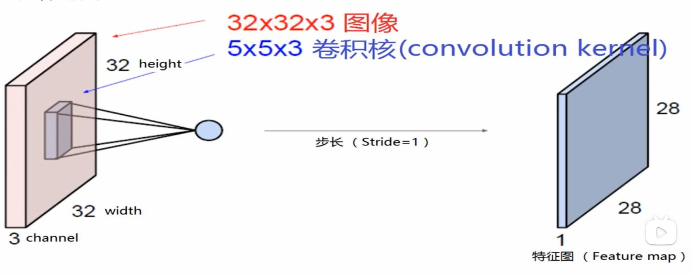
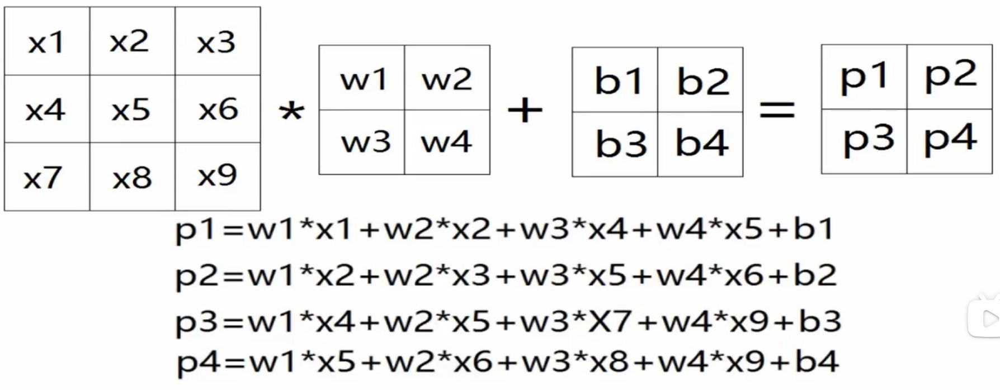
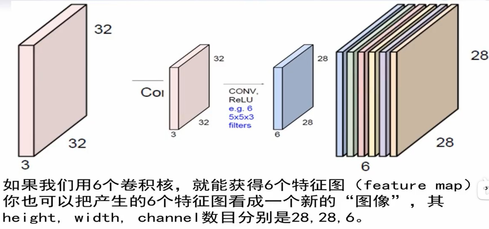
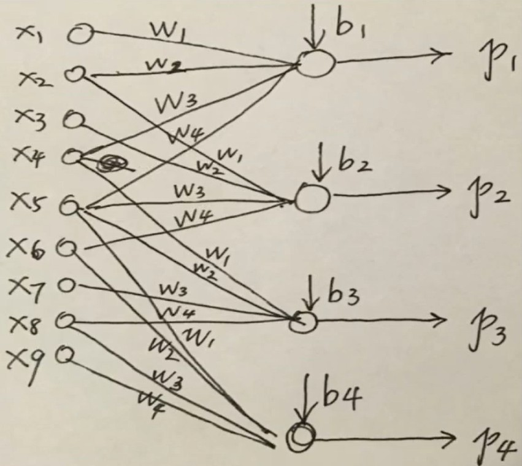
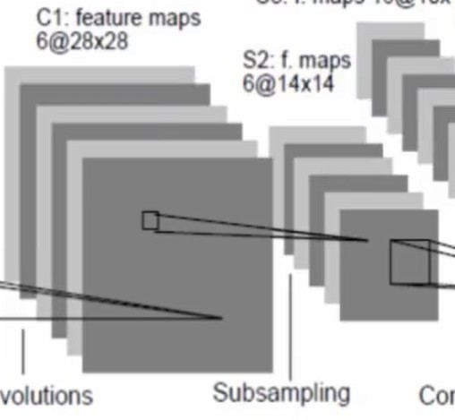

## deep learning

- 90年代支持向量机对神经网络造成冲击。因为神经网络数学不优美，只能找到局部最优，还和输入有关。

<p hidden>学到这里，突然课程关闭了，气死了</p>
<p hidden>找到课程了，https://www.bilibili.com/video/BV1dJ411B7gh?p=26</p>

## 自编码器

## 卷积神经网络

- 由手工设计卷积核 convolution kernel，变成自动学习卷积核

```
什么是卷积核？
F(jw) = ∫f(t)e^(-jwt)dt

其中的 e^(-jwt) 就是卷积核
```

```
以前图形识别算法：
人为设计卷积核，每个卷积核作用于图形。得到图形的一个特征
多个卷积核，多个特征
这些特征再用 SVM 等算法分类
```

```
图象 32*32*3 什么意思？
像素 32*32，彩色 rgb 所以 *3
可以成为 tensor 张量
```

- 卷积核 (W, B, stride) 和图象的作用

卷积核在图象上按步长 stride 移动，重合的地点乘 W 起来加偏置 B 后求和，得到特征图 feature map

</img>

下面是一个 2x2 的卷积核 和 3x3 的图象的作用

</img>

步长不为 1 时，可能图象的边缘无法参与运算，可以通过补 0 padding-zero，把边算进去。

一般用多个同大小的卷积核，得到的输出叠起来。

</img>


- 卷积网络和神经网络的区别。1. 部分连接。2. 共享权重 weight sharing

</img>

- subsampling 降采样

压缩特征图，原来是 28x28，每 2x2 取均值，得到 14x14

</img>

- full connection 全连接乘

- 层层之间需要激活函数，不然就是线性变换

- 性能指标 softmax 交叉熵

- 激活函数 ReLU(x) 激活大致一半神经元

- 降采样 pooling 池化，把附近的区域取一个平均值。最大池：取最大值（梯度怎么做？不是最大梯度当做0）（这相当于一个非线性操作）（相当于只有一个激活）

- 随即丢弃一半神经元，但最后使用时使用全网络测试。（相当于只有一半的神经元激活全0）

## 迁移学习

学一个领域，得到的网络取学另一个领域。

## 神经网络压缩

降低已经训练好的网络的复杂度

## 深度增强网络 alpha go

- 围棋规则

无气自提

```
气：一个子，上下左右四口气

在边界，只有3口气
在顶点，只有1口气

当气点被同色、异色占据了，气就少一个

一个子没有气了，必须被移除棋盘
```

禁止全局同形

```
走一步棋后，棋盘状态必须和之前所有状态不同
```

地大者胜

```
占的地多的胜利
```

- 围棋有必胜策略。但是围棋太复杂，找不到这个策略

任意有限步结束的零和博弈必定有必胜策略

零和博弈：指要么我赢要么你赢

```
证明：数学归纳法
```
