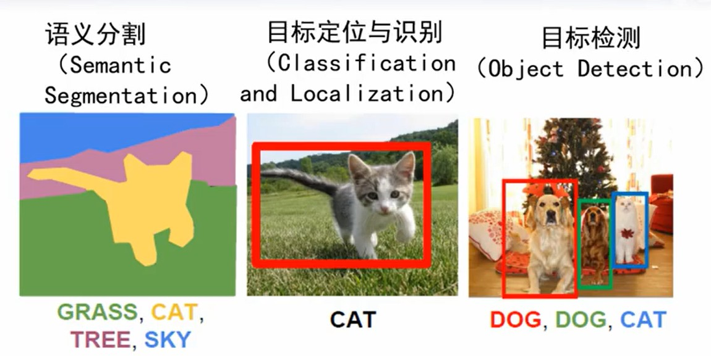
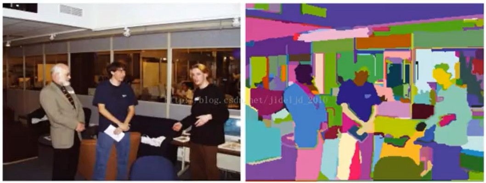

# 目标检测与分割

## 是什么？

</img>

### 目标定位

Adaboost 人脸检测器

- 使用卷积神经网络，目标定位与识别

使用两个神经网络，一个做分类，一个给出目标位置。

### 目标检测

rcnn，先分割图片，然后做目标定位识别。

过分割，再组合。

</img>

fast-rcnn

### 语义分割

全卷积网络

上采样 upsampling

反卷积