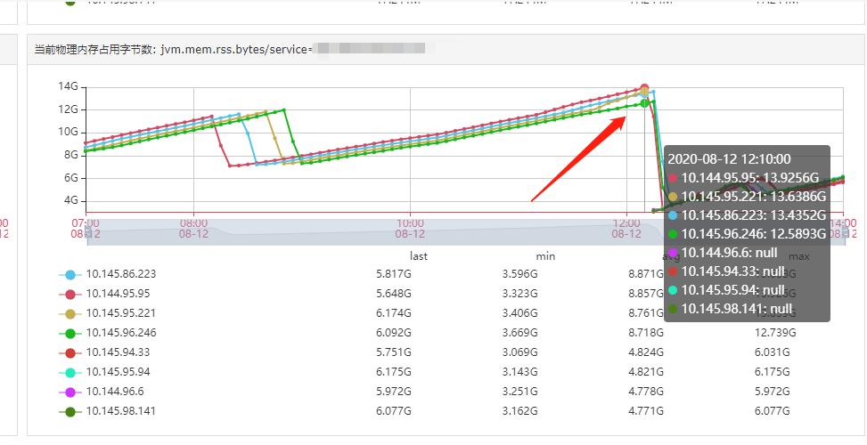

# 一次完整的JVM堆外内存泄漏故障排查记录

## 原文信息

作者：蛮三刀把刀。来自公众号"后端技术漫谈"

地址1：<a href="https://www.cnblogs.com/sushine1/p/13570966.html">https://www.cnblogs.com/sushine1/p/13570966.html</a> 

地址2：<a href="https://mp.weixin.qq.com/s/YJrV6tSvfp58J0ibwHYudQ">https://mp.weixin.qq.com/s/YJrV6tSvfp58J0ibwHYudQ</a> 

## 阅读目的

- 学习常见的 JVM 问题排查思路和工具
- 尝试复现问题：沙箱环境复现

## 文章要点

### 故障描述和排查过程

- 收到故障“服务进程占用容器的物理内存（16G）超过了80%的阈值，并且还在不断上升”。
- 大于4G快要吃满内存应该是JVM堆外内存泄漏



- 确认 JVM 参数

`-Xms4g -Xmx4g -Xmn2g -Xss1024K -XX:PermSize=256m -XX:MaxPermSize=512m -XX:ParallelGCThreads=20 -XX:+UseConcMarkSweepGC -XX:+UseParNewGC -XX:+UseCMSCompactAtFullCollection -XX:CMSInitiatingOccupancyFraction=80`

- 事故当天特殊情况。“当天上午我们正在使用消息队列推送历史数据的修复脚本，该任务会大量调用我们服务其中的某一个接口”。停止推送后，内存不再高速上升。

### 故障原因和解决方案分析

排查这个接口是不是发生了内存泄漏。

- 接口内部主要逻辑是调用集团的 WCS 客户端。因此怀疑是 WCS 的 bug。（WCS客户端底层是由SCF客户端封装的，作为RPC框架，其底层通讯传输协议有可能会申请直接内存）(后来确认不是)

- 沙箱环境复现。问题再次出现。初步猜测：

`堆外内存大量泄漏，但是老年代不满，就不会出发 full gc`

`平时堆外内存泄漏速度慢，full gc 总会到来，回收掉泄漏部门，所以平时不会出问题`

- 使用`-XX:MaxDirectMemorySize`限制堆外内存，**但是问题没有消失**。

- 分析直接内存。需要 JVM 开启监控，然后使用 jcmd 分析。（但是没有分析出问题）

```
-XX:NativeMemoryTracking=[off | summary | detail]
# off: 默认关闭
# summary: 只统计各个分类的内存使用情况.
# detail: Collect memory usage by individual call sites.

jcmd <pid> VM.native_memory [summary | detail | baseline | summary.diff | detail.diff | shutdown] [scale= KB | MB | GB]
 
# summary: 分类内存使用情况.
# detail: 详细内存使用情况，除了summary信息之外还包含了虚拟内存使用情况。
# baseline: 创建内存使用快照，方便和后面做对比
# summary.diff: 和上一次baseline的summary对比
# detail.diff: 和上一次baseline的detail对比
# shutdown: 关闭NMT
```

- 使用`jmap -heap pid`，不仅可以查看堆情况，还可以查看 JVM 参数配置。

- 最终发现，问题出在元空间，而不是 native 内存。

- JVM 参数 `-verbose:class` 可以实时查看类加载的情况。另外还有`-verbose:gc`查看gc情况等等。

- 发现加载了无数个`com.alibaba.fastjson.serializer.ASMSerializer_1_WlkCustomerDto`。经排查，这来自`new SerializeConfig();`，将其静态化，问题解决。