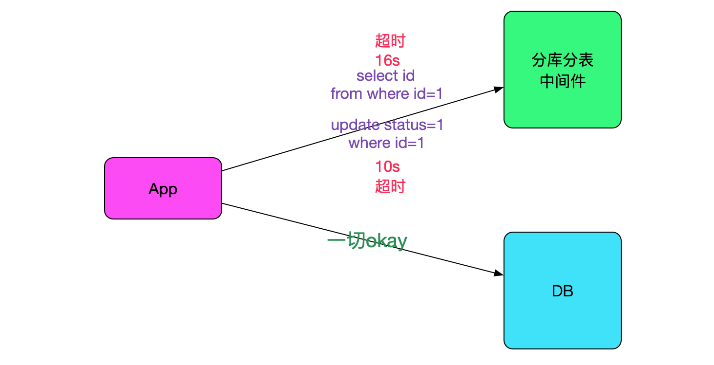
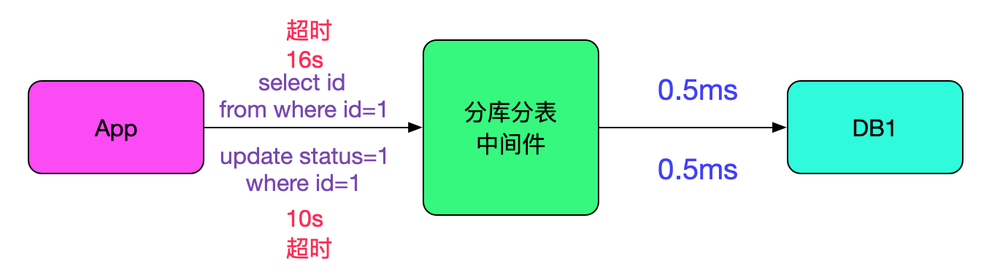
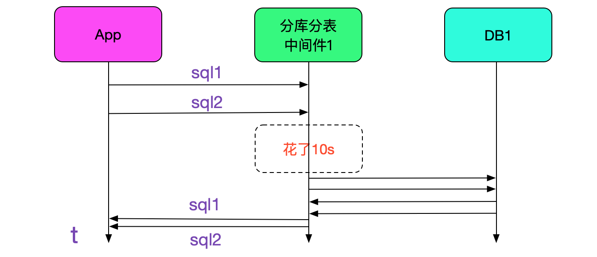
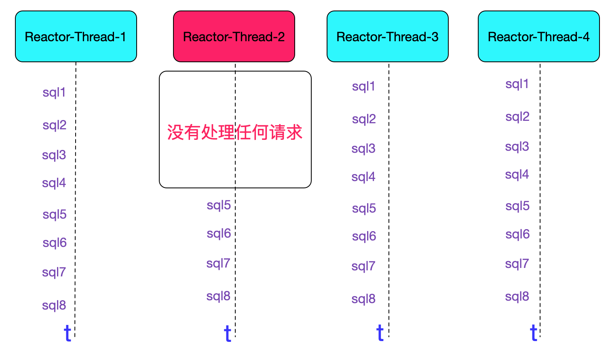

# 记一次中间件导致的慢SQL排查过程

## 原文信息

作者：alchemystar

地址：<a href="https://www.cnblogs.com/alchemystar/p/13625226.html">https://www.cnblogs.com/alchemystar/p/13625226.html</a> 

## 阅读目的

- 学习作者的分析流程
- 欣赏、学习作者画的图

## 文章要点

- 一个自研的`数据库分部分表中间件`，线上每天偶尔有几条 sql 有长达十几秒的超时。超时的 sql 是主键查询或主键更新。
- 业务中只有一部分流量走中间件，另一部分直接走数据库，超时的sql只会在连中间件的时候出现。

- **排查第一步：是否sql确实慢**。“分析了日志，发现那段时间所有的sql在往后端数据执行的时候都只有0.5ms,非常的快。”**日志的重要性体现出来了，这里不仅在 APP 记录了查询耗时，插件/数据库也记录了 sql 耗时**

- **排查第二步：寻找超时规律**。发现偶尔有两个 sql 卡在一起，即同时落到同一台中间件，同时卡住10几秒。

- **排查第三步：对第二步中中间件日志查询**。近10s内处理慢sql的线程都没有打印日志。

- 最后检查慢 sql 具体执行的语句。发现其中有超长字符串（150KB）的匹配和拼接。将模式匹配换成 split ，字符串拼接换成 StringBuilder 。耗时从10s降到8ms。

