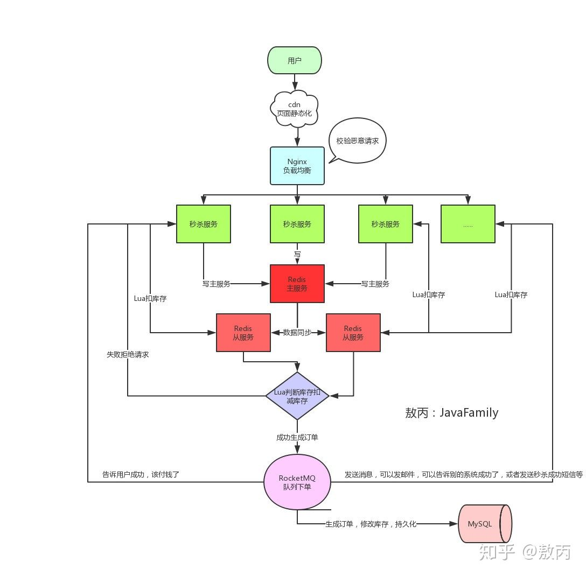

# 如何设计秒杀系统？

## 文章信息

- 作者：敖丙 https://www.zhihu.com/people/aobingJava 
- 地址：https://www.zhihu.com/question/54895548/answer/923987542 

## 秒杀系统需要解决的问题

- 高并发。单机 redis 顶不住，缓存三大问题。
- 超卖。
- 恶意请求。利用脚本抢购，导致普通用户买不到。
- 链接暴露。->链接加盐
- 数据库。如果没有做降级、限流、熔断，导致数据库挂了，其他系统也会奔溃。->服务单一职责

## 设计理念

- 服务单一职责。“就算秒杀没抗住，秒杀库崩了，服务挂了，也不会影响到其他的服务”。
- 秒杀链接加盐。URL动态化。“通过MD5之类的加密算法加密随机的字符串去做 url，然后通过前端代码获取url后台校验才能通过”。
- Redis 集群。
- Nginx 路由。负载均衡、拦截恶意请求（不像人为的请求在网关那一层就得拦截掉了）。
- 资源静态化。cdn服务器。
- 限流。前端限流（点击一下或者两下然后几秒之后才可以继续点击）、后端限流。
- 库存预热。库存放入 redis，不走 DB。

`假如 redis 4个读库，1个写库。还有1个库存，4个app从读库了解到还有库存，同时都去-1，怎么办？`

`答：使用 Lua 脚本实现原子性操作。`

- 限流&降级&熔断&隔离

